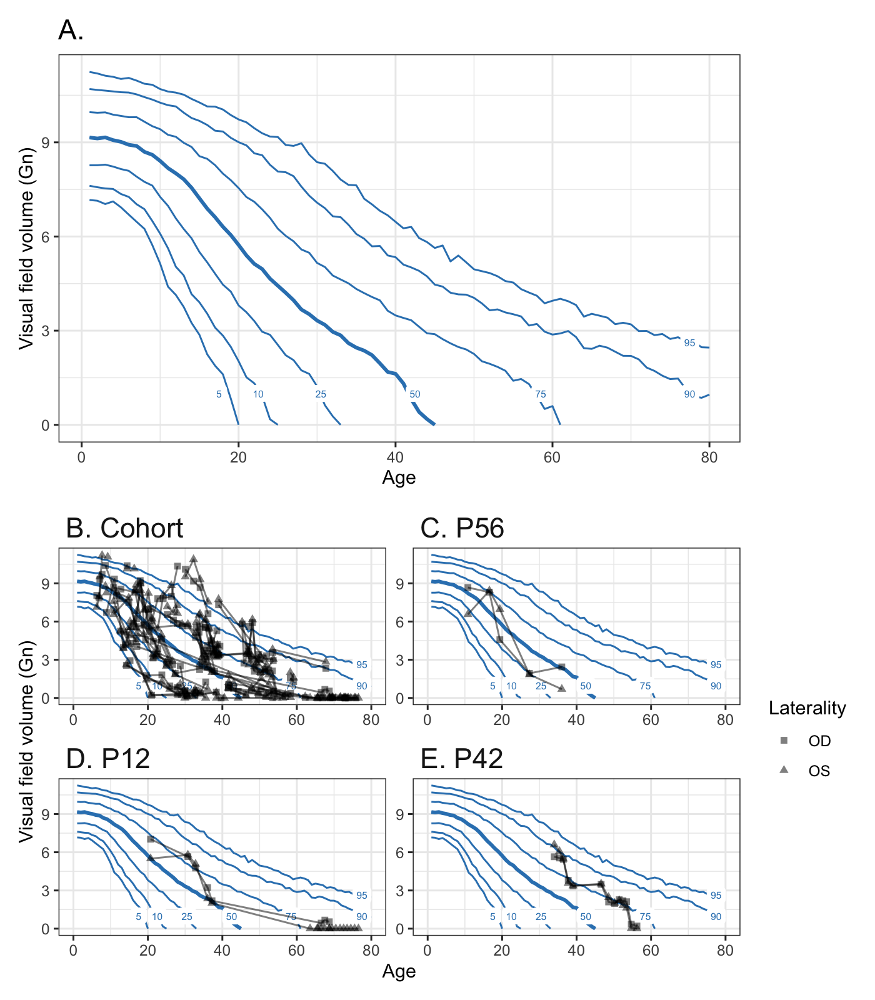

- <a href="#chmgvf2023" id="toc-chmgvf2023">chmgvf2023</a>
  - <a href="#setup" id="toc-setup">Setup</a>
  - <a href="#notes" id="toc-notes">Notes</a>
  - <a href="#data" id="toc-data">Data</a>
  - <a href="#model" id="toc-model">Model</a>

<!-- README.md is generated from README.Rmd. Please edit that file -->

# chmgvf2023

This analysis fits a Bayesian model of Goldmann visual field (GVF)
volume data for a cohort of patients with choroideremia. The analysis is
reported in:

> Adam P. DeLuca, S. Scott Whitmore, Nicole J. Tatro, Jeaneen L. Andorf,
> Ben P. Faga, Laurel A. Faga, Malia M. Collins, Meagan A. Luse, Beau J.
> Fenner, Edwin M. Stone, Todd E. Scheetz. “Using Goldmann visual field
> volume to track disease progression in choroideremia.” (manuscript
> submitted)

## Setup

First, install the latest version of the `R` programming language,
available at <https://www.r-project.org/>.

You can run this file using the R command line, but we recommend that
you use [RStudio Desktop](https://posit.co/download/rstudio-desktop/).

Before you run this analysis and generate the figures for the first
time, install the following packages in R:

<details>
<summary>Show the code</summary>

``` r
install.packages(c("tidyverse", "patchwork", "tidybayes"))
```

</details>

To install the Richard McElreath’s `rethinking` package, follow the
instructions on [this page](https://github.com/rmcelreath/rethinking).
That page also provides links for installing
[Stan](https://mc-stan.org/), the probabilistic programming language
`rethinking` uses to fit Bayesian models.

<details>
<summary>Show the code</summary>

``` r
knitr::opts_chunk$set(
  collapse = TRUE,
  comment = "#>",
  autodep = TRUE,
  dpi = 200,
  cache.lazy = FALSE,
  dev = c("png")
)

library(tidyverse) 
library(rethinking)
library(patchwork)
library(tidybayes)

source(file.path(here::here(), "R", "utilities.R"))
source(file.path(here::here(), "R", "setup_analysis.R"))

max_age <- 80

n_cohort <-
  dataset %>% 
  select(pid) %>% 
  distinct() %>% 
  nrow()
n_cohort_with_volume <-
  dataset %>% 
  filter(!is.na(volume)) %>% 
  select(pid) %>% 
  distinct() %>% 
  nrow()
n_cohort_with_acuity <-
  dataset %>% 
  filter(!is.na(logmar)) %>% 
  select(pid) %>% 
  distinct() %>% 
  nrow()

acuity <-
  dataset %>% 
  filter(!is.na(logmar)) %>%
  select(pid, logmar, laterality, age) 

acuity_for_r2 <-
  acuity %>%
  spread(laterality, logmar) 

acuity_r2 <-
  lm(OD ~ OS, acuity_for_r2) %>%
  summary() %>%
  pluck("r.squared")

gvf_for_r2 <-
  gvf %>% 
  select(pid, age, laterality, volume) %>% 
  spread(laterality, volume)

gvf_r2 <-
  lm(OD ~ OS, gvf_for_r2) %>%
  summary() %>%
  pluck("r.squared")

color_values <-
  c(
    "black", 
    colorspace::qualitative_hcl(n = 1, h = c(0, 230), c = 80, l = 60)
    ) %>% 
  set_names(unique(dataset$mutation_label))

example_pid <- c("P56", "P12", "P42")
```

</details>

## Notes

Stan uses random numbers as part of the model fitting process.
Consequently, the estimates you get from re-running this file will vary
slightly from those in the paper. This also means that the quantile
boundaries in the figures will wiggle a bit as well.

## Data

The data files have 56 patients, 56 have visual acuity, and 52 have GVF
volume data.

## Model

<details>
<summary>Show the code</summary>

``` r
# Construct a couple of example figures to explain the exponential decay model.
toy_example <- 
  tibble(lambda = 0.05, delay = 10, baseline = 11, a = 4, b = -5) %>%
  expand_grid(tibble(age = 0:80)) %>%
  mutate(
    V = 
      exponential_delay(
        age, 
        baseline = baseline, 
        lambda = lambda, 
        delay = delay
        )
    ) %>%
  mutate(segment = if_else(age < delay, "Pre-onset", "Post-onset")) %>%
  mutate(xend = lead(age, default = max(age))) %>%
  mutate(yend = lead(V, default = min(V))) %>%
  mutate(P = inv_logit(a + b * log(V)))

formula_label_1 <- r"($V \sim Normal(\mu, \sigma)$)"
formula_label_2 <- r"($\mu = V_{0} e^{-\lambda (T - d)}$)"

formula_label_3 <- r"($V \sim Bernoulli(\theta)$)"
formula_label_4 <- r"($logit^{-1}(\theta) = a + b \times log(\mu)$)"

p_component_1 <-
  toy_example %>%
  ggplot(aes(x = age, y = V)) +
  geom_segment(aes(x = age, xend = xend, yend = yend, color = segment)) +
  geom_vline(xintercept = 10, alpha = 0.5, linetype = "dotted") +
  labs(
    x = "Age (T)", 
    y = "Visual field volume (V)", 
    title = "A. Delayed exponential"
    ) +
  scale_color_manual(
    guide = "none",
    name = "Phase of disease",
    values = color_values %>% set_names(c("Post-onset", "Pre-onset"))
    ) +
  annotate(
    "text",
    x = 40,
    y = 18/20 * 11,
    label = latex2exp::TeX(formula_label_1, output = "character"),
    parse = TRUE,
    hjust = 0
  ) +  
  annotate(
    "text",
    x = 40,
    y = 15/20 * 11,
    label = latex2exp::TeX(formula_label_2, output = "character"),
    parse = TRUE,
    hjust = 0
  ) +
  scale_y_continuous(limits = c(0, 11)) 

p_component_2a <-
  toy_example %>% 
  ggplot(aes(x = V, y = P)) + 
  geom_line() + 
  annotate(
    "text",
    x = 11 * 0.5,
    y = 18 / 20,
    label = latex2exp::TeX(formula_label_3, output = "character"),
    parse = TRUE,
    hjust = 0
  ) +
   annotate(
    "text",
    x = 11 * 0.5,
    y = 15 / 20,
    label = latex2exp::TeX(formula_label_4, output = "character"),
    parse = TRUE,
    hjust = 0
  ) +  
  labs(
    x = "Mean Volume (µ)", 
    y = "Probability of V = 0", 
    title = "B. Logistic hurdle"
    )

p_component_2b <-
  toy_example %>%
  ggplot(aes(x = age, y = P)) +
  geom_line() +
  labs(
    x = "Age (T)", 
    y = "Probability of V = 0", 
    title = "C. Logistic hurdle as a function to time"
    )

p_component_1 + p_component_2a + p_component_2b + plot_layout(ncol = 2)
```

</details>


<details>
<summary>Show the code</summary>

``` r
# HEADS UP:
# I commit versions of the figures into the Git repository. Including the 
# figures let's me compare the effects of changes in code on the visualized 
# results. However, I don't want the figures changing every time a random
# number is used. To stabilize figures in the repository, I set the random
# number "seed" at the top of code chunks which involve figure generation.
set.seed(7)

mhurdle <-
  ulam(
    alist(
      # Component 1
      V|V>0 ~ custom(log1m(theta) + normal_lpdf(V | mu, sigma)),
      # Component 2
      V|V==0 ~ custom(log(theta)),
      
      logit(theta) <- a + b * mu,
      a ~ dnorm(4, 1),      
      b ~ dnorm(-5, 1),
      
      mu <- 
        # Baseline volume
        V_0 * 
        exp(
          # Rate
          -1 * lambda_chm * exp(z_1[S] * sigma_1) * 
            # Time
            (T - d * exp(z_2[S] * sigma_2) * exp(z_3[SE] * sigma_3))
          ),
      
      # Prior for baseline derived from volumes based on isopters in Patel et
      # al. 2015.      
      V_0 ~ dlnorm(2.42, 0.11), 
      d ~ dlnorm(log(10), log(1.8)),
      lambda_chm ~ dbeta(0.4, 2.76),
 
      z_1[S] ~ dnorm(0, 1),     
      z_2[S] ~ dnorm(0, 1),
      z_3[SE] ~ dnorm(0, 1),

      sigma ~ dexp(1),
      sigma_1 ~ dexp(5),      
      sigma_2 ~ dexp(10),
      sigma_3 ~ dexp(1),
      
      # Per-subject estimates:
      gq> vector[S]:lambda <<- lambda_chm * exp(z_1 * sigma_1),
      gq> vector[S]:delay <<- d * exp(z_2 * sigma_2)
    ),
    data = gvf_list, 
    chains = 4, 
    cores = 4, 
    log_lik = TRUE, 
    control = list(adapt_delta = 0.99)
  )
#> Warning in '/var/folders/81/4zh2qw2d5yn6x4lhgwcz61qc0000gp/T/RtmpHsZ78h/model-a7ad34db0800.stan', line 3, column 4: Declaration
#>     of arrays by placing brackets after a variable name is deprecated and
#>     will be removed in Stan 2.32.0. Instead use the array keyword before the
#>     type. This can be changed automatically using the auto-format flag to
#>     stanc
#> Warning in '/var/folders/81/4zh2qw2d5yn6x4lhgwcz61qc0000gp/T/RtmpHsZ78h/model-a7ad34db0800.stan', line 5, column 4: Declaration
#>     of arrays by placing brackets after a variable name is deprecated and
#>     will be removed in Stan 2.32.0. Instead use the array keyword before the
#>     type. This can be changed automatically using the auto-format flag to
#>     stanc
#> Running MCMC with 4 parallel chains, with 1 thread(s) per chain...
#> Chain 1 Rejecting initial value:
#> Chain 1   Error evaluating the log probability at the initial value.
#> Chain 1 Exception: normal_lpdf: Location parameter is inf, but must be finite! (in '/var/folders/81/4zh2qw2d5yn6x4lhgwcz61qc0000gp/T/RtmpHsZ78h/model-a7ad34db0800.stan', line 46, column 24 to column 85)
#> Chain 1 Exception: normal_lpdf: Location parameter is inf, but must be finite! (in '/var/folders/81/4zh2qw2d5yn6x4lhgwcz61qc0000gp/T/RtmpHsZ78h/model-a7ad34db0800.stan', line 46, column 24 to column 85)
#> Chain 1 Rejecting initial value:
#> Chain 1   Error evaluating the log probability at the initial value.
#> Chain 1 Exception: normal_lpdf: Location parameter is inf, but must be finite! (in '/var/folders/81/4zh2qw2d5yn6x4lhgwcz61qc0000gp/T/RtmpHsZ78h/model-a7ad34db0800.stan', line 46, column 24 to column 85)
#> Chain 1 Exception: normal_lpdf: Location parameter is inf, but must be finite! (in '/var/folders/81/4zh2qw2d5yn6x4lhgwcz61qc0000gp/T/RtmpHsZ78h/model-a7ad34db0800.stan', line 46, column 24 to column 85)
#> Chain 1 Rejecting initial value:
#> Chain 1   Error evaluating the log probability at the initial value.
#> Chain 1 Exception: normal_lpdf: Location parameter is inf, but must be finite! (in '/var/folders/81/4zh2qw2d5yn6x4lhgwcz61qc0000gp/T/RtmpHsZ78h/model-a7ad34db0800.stan', line 46, column 24 to column 85)
#> Chain 1 Exception: normal_lpdf: Location parameter is inf, but must be finite! (in '/var/folders/81/4zh2qw2d5yn6x4lhgwcz61qc0000gp/T/RtmpHsZ78h/model-a7ad34db0800.stan', line 46, column 24 to column 85)
#> Chain 1 Rejecting initial value:
#> Chain 1   Log probability evaluates to log(0), i.e. negative infinity.
#> Chain 1   Stan can't start sampling from this initial value.
#> Chain 1 Iteration:   1 / 1000 [  0%]  (Warmup)
#> Chain 1 Informational Message: The current Metropolis proposal is about to be rejected because of the following issue:
#> Chain 1 Exception: normal_lpdf: Location parameter is inf, but must be finite! (in '/var/folders/81/4zh2qw2d5yn6x4lhgwcz61qc0000gp/T/RtmpHsZ78h/model-a7ad34db0800.stan', line 46, column 24 to column 85)
#> Chain 1 If this warning occurs sporadically, such as for highly constrained variable types like covariance matrices, then the sampler is fine,
#> Chain 1 but if this warning occurs often then your model may be either severely ill-conditioned or misspecified.
#> Chain 1
#> Chain 1 Informational Message: The current Metropolis proposal is about to be rejected because of the following issue:
#> Chain 1 Exception: normal_lpdf: Location parameter is inf, but must be finite! (in '/var/folders/81/4zh2qw2d5yn6x4lhgwcz61qc0000gp/T/RtmpHsZ78h/model-a7ad34db0800.stan', line 46, column 24 to column 85)
#> Chain 1 If this warning occurs sporadically, such as for highly constrained variable types like covariance matrices, then the sampler is fine,
#> Chain 1 but if this warning occurs often then your model may be either severely ill-conditioned or misspecified.
#> Chain 1
#> Chain 1 Informational Message: The current Metropolis proposal is about to be rejected because of the following issue:
#> Chain 1 Exception: normal_lpdf: Location parameter is inf, but must be finite! (in '/var/folders/81/4zh2qw2d5yn6x4lhgwcz61qc0000gp/T/RtmpHsZ78h/model-a7ad34db0800.stan', line 46, column 24 to column 85)
#> Chain 1 If this warning occurs sporadically, such as for highly constrained variable types like covariance matrices, then the sampler is fine,
#> Chain 1 but if this warning occurs often then your model may be either severely ill-conditioned or misspecified.
#> Chain 1
#> Chain 1 Informational Message: The current Metropolis proposal is about to be rejected because of the following issue:
#> Chain 1 Exception: normal_lpdf: Location parameter is inf, but must be finite! (in '/var/folders/81/4zh2qw2d5yn6x4lhgwcz61qc0000gp/T/RtmpHsZ78h/model-a7ad34db0800.stan', line 46, column 24 to column 85)
#> Chain 1 If this warning occurs sporadically, such as for highly constrained variable types like covariance matrices, then the sampler is fine,
#> Chain 1 but if this warning occurs often then your model may be either severely ill-conditioned or misspecified.
#> Chain 1
#> Chain 1 Informational Message: The current Metropolis proposal is about to be rejected because of the following issue:
#> Chain 1 Exception: normal_lpdf: Location parameter is inf, but must be finite! (in '/var/folders/81/4zh2qw2d5yn6x4lhgwcz61qc0000gp/T/RtmpHsZ78h/model-a7ad34db0800.stan', line 46, column 24 to column 85)
#> Chain 1 If this warning occurs sporadically, such as for highly constrained variable types like covariance matrices, then the sampler is fine,
#> Chain 1 but if this warning occurs often then your model may be either severely ill-conditioned or misspecified.
#> Chain 1
#> Chain 2 Rejecting initial value:
#> Chain 2   Error evaluating the log probability at the initial value.
#> Chain 2 Exception: normal_lpdf: Location parameter is inf, but must be finite! (in '/var/folders/81/4zh2qw2d5yn6x4lhgwcz61qc0000gp/T/RtmpHsZ78h/model-a7ad34db0800.stan', line 46, column 24 to column 85)
#> Chain 2 Exception: normal_lpdf: Location parameter is inf, but must be finite! (in '/var/folders/81/4zh2qw2d5yn6x4lhgwcz61qc0000gp/T/RtmpHsZ78h/model-a7ad34db0800.stan', line 46, column 24 to column 85)
#> Chain 2 Rejecting initial value:
#> Chain 2   Error evaluating the log probability at the initial value.
#> Chain 2 Exception: normal_lpdf: Location parameter is inf, but must be finite! (in '/var/folders/81/4zh2qw2d5yn6x4lhgwcz61qc0000gp/T/RtmpHsZ78h/model-a7ad34db0800.stan', line 46, column 24 to column 85)
#> Chain 2 Exception: normal_lpdf: Location parameter is inf, but must be finite! (in '/var/folders/81/4zh2qw2d5yn6x4lhgwcz61qc0000gp/T/RtmpHsZ78h/model-a7ad34db0800.stan', line 46, column 24 to column 85)
#> Chain 2 Iteration:   1 / 1000 [  0%]  (Warmup)
#> Chain 2 Informational Message: The current Metropolis proposal is about to be rejected because of the following issue:
#> Chain 2 Exception: normal_lpdf: Location parameter is nan, but must be finite! (in '/var/folders/81/4zh2qw2d5yn6x4lhgwcz61qc0000gp/T/RtmpHsZ78h/model-a7ad34db0800.stan', line 46, column 24 to column 85)
#> Chain 2 If this warning occurs sporadically, such as for highly constrained variable types like covariance matrices, then the sampler is fine,
#> Chain 2 but if this warning occurs often then your model may be either severely ill-conditioned or misspecified.
#> Chain 2
#> Chain 2 Informational Message: The current Metropolis proposal is about to be rejected because of the following issue:
#> Chain 2 Exception: normal_lpdf: Location parameter is nan, but must be finite! (in '/var/folders/81/4zh2qw2d5yn6x4lhgwcz61qc0000gp/T/RtmpHsZ78h/model-a7ad34db0800.stan', line 46, column 24 to column 85)
#> Chain 2 If this warning occurs sporadically, such as for highly constrained variable types like covariance matrices, then the sampler is fine,
#> Chain 2 but if this warning occurs often then your model may be either severely ill-conditioned or misspecified.
#> Chain 2
#> Chain 2 Informational Message: The current Metropolis proposal is about to be rejected because of the following issue:
#> Chain 2 Exception: normal_lpdf: Location parameter is nan, but must be finite! (in '/var/folders/81/4zh2qw2d5yn6x4lhgwcz61qc0000gp/T/RtmpHsZ78h/model-a7ad34db0800.stan', line 46, column 24 to column 85)
#> Chain 2 If this warning occurs sporadically, such as for highly constrained variable types like covariance matrices, then the sampler is fine,
#> Chain 2 but if this warning occurs often then your model may be either severely ill-conditioned or misspecified.
#> Chain 2
#> Chain 2 Informational Message: The current Metropolis proposal is about to be rejected because of the following issue:
#> Chain 2 Exception: normal_lpdf: Location parameter is nan, but must be finite! (in '/var/folders/81/4zh2qw2d5yn6x4lhgwcz61qc0000gp/T/RtmpHsZ78h/model-a7ad34db0800.stan', line 46, column 24 to column 85)
#> Chain 2 If this warning occurs sporadically, such as for highly constrained variable types like covariance matrices, then the sampler is fine,
#> Chain 2 but if this warning occurs often then your model may be either severely ill-conditioned or misspecified.
#> Chain 2
#> Chain 2 Informational Message: The current Metropolis proposal is about to be rejected because of the following issue:
#> Chain 2 Exception: normal_lpdf: Location parameter is nan, but must be finite! (in '/var/folders/81/4zh2qw2d5yn6x4lhgwcz61qc0000gp/T/RtmpHsZ78h/model-a7ad34db0800.stan', line 46, column 24 to column 85)
#> Chain 2 If this warning occurs sporadically, such as for highly constrained variable types like covariance matrices, then the sampler is fine,
#> Chain 2 but if this warning occurs often then your model may be either severely ill-conditioned or misspecified.
#> Chain 2
#> Chain 2 Informational Message: The current Metropolis proposal is about to be rejected because of the following issue:
#> Chain 2 Exception: normal_lpdf: Location parameter is nan, but must be finite! (in '/var/folders/81/4zh2qw2d5yn6x4lhgwcz61qc0000gp/T/RtmpHsZ78h/model-a7ad34db0800.stan', line 46, column 24 to column 85)
#> Chain 2 If this warning occurs sporadically, such as for highly constrained variable types like covariance matrices, then the sampler is fine,
#> Chain 2 but if this warning occurs often then your model may be either severely ill-conditioned or misspecified.
#> Chain 2
#> Chain 2 Informational Message: The current Metropolis proposal is about to be rejected because of the following issue:
#> Chain 2 Exception: normal_lpdf: Location parameter is inf, but must be finite! (in '/var/folders/81/4zh2qw2d5yn6x4lhgwcz61qc0000gp/T/RtmpHsZ78h/model-a7ad34db0800.stan', line 46, column 24 to column 85)
#> Chain 2 If this warning occurs sporadically, such as for highly constrained variable types like covariance matrices, then the sampler is fine,
#> Chain 2 but if this warning occurs often then your model may be either severely ill-conditioned or misspecified.
#> Chain 2
#> Chain 2 Informational Message: The current Metropolis proposal is about to be rejected because of the following issue:
#> Chain 2 Exception: normal_lpdf: Location parameter is inf, but must be finite! (in '/var/folders/81/4zh2qw2d5yn6x4lhgwcz61qc0000gp/T/RtmpHsZ78h/model-a7ad34db0800.stan', line 46, column 24 to column 85)
#> Chain 2 If this warning occurs sporadically, such as for highly constrained variable types like covariance matrices, then the sampler is fine,
#> Chain 2 but if this warning occurs often then your model may be either severely ill-conditioned or misspecified.
#> Chain 2
#> Chain 2 Informational Message: The current Metropolis proposal is about to be rejected because of the following issue:
#> Chain 2 Exception: normal_lpdf: Location parameter is inf, but must be finite! (in '/var/folders/81/4zh2qw2d5yn6x4lhgwcz61qc0000gp/T/RtmpHsZ78h/model-a7ad34db0800.stan', line 46, column 24 to column 85)
#> Chain 2 If this warning occurs sporadically, such as for highly constrained variable types like covariance matrices, then the sampler is fine,
#> Chain 2 but if this warning occurs often then your model may be either severely ill-conditioned or misspecified.
#> Chain 2
#> Chain 3 Rejecting initial value:
#> Chain 3   Error evaluating the log probability at the initial value.
#> Chain 3 Exception: normal_lpdf: Location parameter is inf, but must be finite! (in '/var/folders/81/4zh2qw2d5yn6x4lhgwcz61qc0000gp/T/RtmpHsZ78h/model-a7ad34db0800.stan', line 46, column 24 to column 85)
#> Chain 3 Exception: normal_lpdf: Location parameter is inf, but must be finite! (in '/var/folders/81/4zh2qw2d5yn6x4lhgwcz61qc0000gp/T/RtmpHsZ78h/model-a7ad34db0800.stan', line 46, column 24 to column 85)
#> Chain 3 Rejecting initial value:
#> Chain 3   Error evaluating the log probability at the initial value.
#> Chain 3 Exception: normal_lpdf: Location parameter is inf, but must be finite! (in '/var/folders/81/4zh2qw2d5yn6x4lhgwcz61qc0000gp/T/RtmpHsZ78h/model-a7ad34db0800.stan', line 46, column 24 to column 85)
#> Chain 3 Exception: normal_lpdf: Location parameter is inf, but must be finite! (in '/var/folders/81/4zh2qw2d5yn6x4lhgwcz61qc0000gp/T/RtmpHsZ78h/model-a7ad34db0800.stan', line 46, column 24 to column 85)
#> Chain 3 Rejecting initial value:
#> Chain 3   Error evaluating the log probability at the initial value.
#> Chain 3 Exception: normal_lpdf: Location parameter is inf, but must be finite! (in '/var/folders/81/4zh2qw2d5yn6x4lhgwcz61qc0000gp/T/RtmpHsZ78h/model-a7ad34db0800.stan', line 46, column 24 to column 85)
#> Chain 3 Exception: normal_lpdf: Location parameter is inf, but must be finite! (in '/var/folders/81/4zh2qw2d5yn6x4lhgwcz61qc0000gp/T/RtmpHsZ78h/model-a7ad34db0800.stan', line 46, column 24 to column 85)
#> Chain 3 Rejecting initial value:
#> Chain 3   Error evaluating the log probability at the initial value.
#> Chain 3 Exception: normal_lpdf: Location parameter is inf, but must be finite! (in '/var/folders/81/4zh2qw2d5yn6x4lhgwcz61qc0000gp/T/RtmpHsZ78h/model-a7ad34db0800.stan', line 46, column 24 to column 85)
#> Chain 3 Exception: normal_lpdf: Location parameter is inf, but must be finite! (in '/var/folders/81/4zh2qw2d5yn6x4lhgwcz61qc0000gp/T/RtmpHsZ78h/model-a7ad34db0800.stan', line 46, column 24 to column 85)
#> Chain 3 Rejecting initial value:
#> Chain 3   Log probability evaluates to log(0), i.e. negative infinity.
#> Chain 3   Stan can't start sampling from this initial value.
#> Chain 3 Rejecting initial value:
#> Chain 3   Log probability evaluates to log(0), i.e. negative infinity.
#> Chain 3   Stan can't start sampling from this initial value.
#> Chain 3 Rejecting initial value:
#> Chain 3   Error evaluating the log probability at the initial value.
#> Chain 3 Exception: normal_lpdf: Location parameter is inf, but must be finite! (in '/var/folders/81/4zh2qw2d5yn6x4lhgwcz61qc0000gp/T/RtmpHsZ78h/model-a7ad34db0800.stan', line 46, column 24 to column 85)
#> Chain 3 Exception: normal_lpdf: Location parameter is inf, but must be finite! (in '/var/folders/81/4zh2qw2d5yn6x4lhgwcz61qc0000gp/T/RtmpHsZ78h/model-a7ad34db0800.stan', line 46, column 24 to column 85)
#> Chain 3 Rejecting initial value:
#> Chain 3   Log probability evaluates to log(0), i.e. negative infinity.
#> Chain 3   Stan can't start sampling from this initial value.
#> Chain 3 Rejecting initial value:
#> Chain 3   Error evaluating the log probability at the initial value.
#> Chain 3 Exception: normal_lpdf: Location parameter is inf, but must be finite! (in '/var/folders/81/4zh2qw2d5yn6x4lhgwcz61qc0000gp/T/RtmpHsZ78h/model-a7ad34db0800.stan', line 46, column 24 to column 85)
#> Chain 3 Exception: normal_lpdf: Location parameter is inf, but must be finite! (in '/var/folders/81/4zh2qw2d5yn6x4lhgwcz61qc0000gp/T/RtmpHsZ78h/model-a7ad34db0800.stan', line 46, column 24 to column 85)
#> Chain 3 Rejecting initial value:
#> Chain 3   Error evaluating the log probability at the initial value.
#> Chain 3 Exception: normal_lpdf: Location parameter is inf, but must be finite! (in '/var/folders/81/4zh2qw2d5yn6x4lhgwcz61qc0000gp/T/RtmpHsZ78h/model-a7ad34db0800.stan', line 46, column 24 to column 85)
#> Chain 3 Exception: normal_lpdf: Location parameter is inf, but must be finite! (in '/var/folders/81/4zh2qw2d5yn6x4lhgwcz61qc0000gp/T/RtmpHsZ78h/model-a7ad34db0800.stan', line 46, column 24 to column 85)
#> Chain 3 Rejecting initial value:
#> Chain 3   Error evaluating the log probability at the initial value.
#> Chain 3 Exception: normal_lpdf: Location parameter is inf, but must be finite! (in '/var/folders/81/4zh2qw2d5yn6x4lhgwcz61qc0000gp/T/RtmpHsZ78h/model-a7ad34db0800.stan', line 46, column 24 to column 85)
#> Chain 3 Exception: normal_lpdf: Location parameter is inf, but must be finite! (in '/var/folders/81/4zh2qw2d5yn6x4lhgwcz61qc0000gp/T/RtmpHsZ78h/model-a7ad34db0800.stan', line 46, column 24 to column 85)
#> Chain 3 Rejecting initial value:
#> Chain 3   Error evaluating the log probability at the initial value.
#> Chain 3 Exception: normal_lpdf: Location parameter is inf, but must be finite! (in '/var/folders/81/4zh2qw2d5yn6x4lhgwcz61qc0000gp/T/RtmpHsZ78h/model-a7ad34db0800.stan', line 46, column 24 to column 85)
#> Chain 3 Exception: normal_lpdf: Location parameter is inf, but must be finite! (in '/var/folders/81/4zh2qw2d5yn6x4lhgwcz61qc0000gp/T/RtmpHsZ78h/model-a7ad34db0800.stan', line 46, column 24 to column 85)
#> Chain 3 Rejecting initial value:
#> Chain 3   Error evaluating the log probability at the initial value.
#> Chain 3 Exception: normal_lpdf: Location parameter is inf, but must be finite! (in '/var/folders/81/4zh2qw2d5yn6x4lhgwcz61qc0000gp/T/RtmpHsZ78h/model-a7ad34db0800.stan', line 46, column 24 to column 85)
#> Chain 3 Exception: normal_lpdf: Location parameter is inf, but must be finite! (in '/var/folders/81/4zh2qw2d5yn6x4lhgwcz61qc0000gp/T/RtmpHsZ78h/model-a7ad34db0800.stan', line 46, column 24 to column 85)
#> Chain 3 Iteration:   1 / 1000 [  0%]  (Warmup)
#> Chain 3 Informational Message: The current Metropolis proposal is about to be rejected because of the following issue:
#> Chain 3 Exception: normal_lpdf: Location parameter is nan, but must be finite! (in '/var/folders/81/4zh2qw2d5yn6x4lhgwcz61qc0000gp/T/RtmpHsZ78h/model-a7ad34db0800.stan', line 46, column 24 to column 85)
#> Chain 3 If this warning occurs sporadically, such as for highly constrained variable types like covariance matrices, then the sampler is fine,
#> Chain 3 but if this warning occurs often then your model may be either severely ill-conditioned or misspecified.
#> Chain 3
#> Chain 3 Informational Message: The current Metropolis proposal is about to be rejected because of the following issue:
#> Chain 3 Exception: normal_lpdf: Location parameter is nan, but must be finite! (in '/var/folders/81/4zh2qw2d5yn6x4lhgwcz61qc0000gp/T/RtmpHsZ78h/model-a7ad34db0800.stan', line 46, column 24 to column 85)
#> Chain 3 If this warning occurs sporadically, such as for highly constrained variable types like covariance matrices, then the sampler is fine,
#> Chain 3 but if this warning occurs often then your model may be either severely ill-conditioned or misspecified.
#> Chain 3
#> Chain 3 Informational Message: The current Metropolis proposal is about to be rejected because of the following issue:
#> Chain 3 Exception: normal_lpdf: Location parameter is inf, but must be finite! (in '/var/folders/81/4zh2qw2d5yn6x4lhgwcz61qc0000gp/T/RtmpHsZ78h/model-a7ad34db0800.stan', line 46, column 24 to column 85)
#> Chain 3 If this warning occurs sporadically, such as for highly constrained variable types like covariance matrices, then the sampler is fine,
#> Chain 3 but if this warning occurs often then your model may be either severely ill-conditioned or misspecified.
#> Chain 3
#> Chain 3 Informational Message: The current Metropolis proposal is about to be rejected because of the following issue:
#> Chain 3 Exception: normal_lpdf: Location parameter is inf, but must be finite! (in '/var/folders/81/4zh2qw2d5yn6x4lhgwcz61qc0000gp/T/RtmpHsZ78h/model-a7ad34db0800.stan', line 46, column 24 to column 85)
#> Chain 3 If this warning occurs sporadically, such as for highly constrained variable types like covariance matrices, then the sampler is fine,
#> Chain 3 but if this warning occurs often then your model may be either severely ill-conditioned or misspecified.
#> Chain 3
#> Chain 3 Informational Message: The current Metropolis proposal is about to be rejected because of the following issue:
#> Chain 3 Exception: normal_lpdf: Location parameter is inf, but must be finite! (in '/var/folders/81/4zh2qw2d5yn6x4lhgwcz61qc0000gp/T/RtmpHsZ78h/model-a7ad34db0800.stan', line 46, column 24 to column 85)
#> Chain 3 If this warning occurs sporadically, such as for highly constrained variable types like covariance matrices, then the sampler is fine,
#> Chain 3 but if this warning occurs often then your model may be either severely ill-conditioned or misspecified.
#> Chain 3
#> Chain 3 Informational Message: The current Metropolis proposal is about to be rejected because of the following issue:
#> Chain 3 Exception: normal_lpdf: Location parameter is inf, but must be finite! (in '/var/folders/81/4zh2qw2d5yn6x4lhgwcz61qc0000gp/T/RtmpHsZ78h/model-a7ad34db0800.stan', line 46, column 24 to column 85)
#> Chain 3 If this warning occurs sporadically, such as for highly constrained variable types like covariance matrices, then the sampler is fine,
#> Chain 3 but if this warning occurs often then your model may be either severely ill-conditioned or misspecified.
#> Chain 3
#> Chain 3 Informational Message: The current Metropolis proposal is about to be rejected because of the following issue:
#> Chain 3 Exception: normal_lpdf: Location parameter is nan, but must be finite! (in '/var/folders/81/4zh2qw2d5yn6x4lhgwcz61qc0000gp/T/RtmpHsZ78h/model-a7ad34db0800.stan', line 46, column 24 to column 85)
#> Chain 3 If this warning occurs sporadically, such as for highly constrained variable types like covariance matrices, then the sampler is fine,
#> Chain 3 but if this warning occurs often then your model may be either severely ill-conditioned or misspecified.
#> Chain 3
#> Chain 3 Informational Message: The current Metropolis proposal is about to be rejected because of the following issue:
#> Chain 3 Exception: normal_lpdf: Location parameter is inf, but must be finite! (in '/var/folders/81/4zh2qw2d5yn6x4lhgwcz61qc0000gp/T/RtmpHsZ78h/model-a7ad34db0800.stan', line 46, column 24 to column 85)
#> Chain 3 If this warning occurs sporadically, such as for highly constrained variable types like covariance matrices, then the sampler is fine,
#> Chain 3 but if this warning occurs often then your model may be either severely ill-conditioned or misspecified.
#> Chain 3
#> Chain 4 Rejecting initial value:
#> Chain 4   Error evaluating the log probability at the initial value.
#> Chain 4 Exception: normal_lpdf: Location parameter is inf, but must be finite! (in '/var/folders/81/4zh2qw2d5yn6x4lhgwcz61qc0000gp/T/RtmpHsZ78h/model-a7ad34db0800.stan', line 46, column 24 to column 85)
#> Chain 4 Exception: normal_lpdf: Location parameter is inf, but must be finite! (in '/var/folders/81/4zh2qw2d5yn6x4lhgwcz61qc0000gp/T/RtmpHsZ78h/model-a7ad34db0800.stan', line 46, column 24 to column 85)
#> Chain 4 Rejecting initial value:
#> Chain 4   Log probability evaluates to log(0), i.e. negative infinity.
#> Chain 4   Stan can't start sampling from this initial value.
#> Chain 4 Rejecting initial value:
#> Chain 4   Log probability evaluates to log(0), i.e. negative infinity.
#> Chain 4   Stan can't start sampling from this initial value.
#> Chain 4 Iteration:   1 / 1000 [  0%]  (Warmup)
#> Chain 4 Informational Message: The current Metropolis proposal is about to be rejected because of the following issue:
#> Chain 4 Exception: normal_lpdf: Location parameter is inf, but must be finite! (in '/var/folders/81/4zh2qw2d5yn6x4lhgwcz61qc0000gp/T/RtmpHsZ78h/model-a7ad34db0800.stan', line 46, column 24 to column 85)
#> Chain 4 If this warning occurs sporadically, such as for highly constrained variable types like covariance matrices, then the sampler is fine,
#> Chain 4 but if this warning occurs often then your model may be either severely ill-conditioned or misspecified.
#> Chain 4
#> Chain 4 Informational Message: The current Metropolis proposal is about to be rejected because of the following issue:
#> Chain 4 Exception: normal_lpdf: Location parameter is inf, but must be finite! (in '/var/folders/81/4zh2qw2d5yn6x4lhgwcz61qc0000gp/T/RtmpHsZ78h/model-a7ad34db0800.stan', line 46, column 24 to column 85)
#> Chain 4 If this warning occurs sporadically, such as for highly constrained variable types like covariance matrices, then the sampler is fine,
#> Chain 4 but if this warning occurs often then your model may be either severely ill-conditioned or misspecified.
#> Chain 4
#> Chain 4 Informational Message: The current Metropolis proposal is about to be rejected because of the following issue:
#> Chain 4 Exception: normal_lpdf: Location parameter is nan, but must be finite! (in '/var/folders/81/4zh2qw2d5yn6x4lhgwcz61qc0000gp/T/RtmpHsZ78h/model-a7ad34db0800.stan', line 46, column 24 to column 85)
#> Chain 4 If this warning occurs sporadically, such as for highly constrained variable types like covariance matrices, then the sampler is fine,
#> Chain 4 but if this warning occurs often then your model may be either severely ill-conditioned or misspecified.
#> Chain 4
#> Chain 2 Iteration: 100 / 1000 [ 10%]  (Warmup)
#> Chain 2 Informational Message: The current Metropolis proposal is about to be rejected because of the following issue:
#> Chain 2 Exception: normal_lpdf: Location parameter is inf, but must be finite! (in '/var/folders/81/4zh2qw2d5yn6x4lhgwcz61qc0000gp/T/RtmpHsZ78h/model-a7ad34db0800.stan', line 46, column 24 to column 85)
#> Chain 2 If this warning occurs sporadically, such as for highly constrained variable types like covariance matrices, then the sampler is fine,
#> Chain 2 but if this warning occurs often then your model may be either severely ill-conditioned or misspecified.
#> Chain 2
#> Chain 3 Iteration: 100 / 1000 [ 10%]  (Warmup) 
#> Chain 1 Iteration: 100 / 1000 [ 10%]  (Warmup) 
#> Chain 4 Iteration: 100 / 1000 [ 10%]  (Warmup)
#> Chain 4 Informational Message: The current Metropolis proposal is about to be rejected because of the following issue:
#> Chain 4 Exception: normal_lpdf: Location parameter is inf, but must be finite! (in '/var/folders/81/4zh2qw2d5yn6x4lhgwcz61qc0000gp/T/RtmpHsZ78h/model-a7ad34db0800.stan', line 46, column 24 to column 85)
#> Chain 4 If this warning occurs sporadically, such as for highly constrained variable types like covariance matrices, then the sampler is fine,
#> Chain 4 but if this warning occurs often then your model may be either severely ill-conditioned or misspecified.
#> Chain 4
#> Chain 2 Iteration: 200 / 1000 [ 20%]  (Warmup) 
#> Chain 3 Iteration: 200 / 1000 [ 20%]  (Warmup) 
#> Chain 4 Iteration: 200 / 1000 [ 20%]  (Warmup) 
#> Chain 1 Iteration: 200 / 1000 [ 20%]  (Warmup) 
#> Chain 2 Iteration: 300 / 1000 [ 30%]  (Warmup) 
#> Chain 4 Iteration: 300 / 1000 [ 30%]  (Warmup) 
#> Chain 1 Iteration: 300 / 1000 [ 30%]  (Warmup) 
#> Chain 3 Iteration: 300 / 1000 [ 30%]  (Warmup) 
#> Chain 2 Iteration: 400 / 1000 [ 40%]  (Warmup) 
#> Chain 4 Iteration: 400 / 1000 [ 40%]  (Warmup) 
#> Chain 1 Iteration: 400 / 1000 [ 40%]  (Warmup) 
#> Chain 3 Iteration: 400 / 1000 [ 40%]  (Warmup) 
#> Chain 2 Iteration: 500 / 1000 [ 50%]  (Warmup) 
#> Chain 2 Iteration: 501 / 1000 [ 50%]  (Sampling) 
#> Chain 4 Iteration: 500 / 1000 [ 50%]  (Warmup) 
#> Chain 4 Iteration: 501 / 1000 [ 50%]  (Sampling) 
#> Chain 1 Iteration: 500 / 1000 [ 50%]  (Warmup) 
#> Chain 1 Iteration: 501 / 1000 [ 50%]  (Sampling) 
#> Chain 3 Iteration: 500 / 1000 [ 50%]  (Warmup) 
#> Chain 3 Iteration: 501 / 1000 [ 50%]  (Sampling) 
#> Chain 4 Iteration: 600 / 1000 [ 60%]  (Sampling) 
#> Chain 3 Iteration: 600 / 1000 [ 60%]  (Sampling) 
#> Chain 2 Iteration: 600 / 1000 [ 60%]  (Sampling) 
#> Chain 4 Iteration: 700 / 1000 [ 70%]  (Sampling) 
#> Chain 1 Iteration: 600 / 1000 [ 60%]  (Sampling) 
#> Chain 3 Iteration: 700 / 1000 [ 70%]  (Sampling) 
#> Chain 4 Iteration: 800 / 1000 [ 80%]  (Sampling) 
#> Chain 2 Iteration: 700 / 1000 [ 70%]  (Sampling) 
#> Chain 3 Iteration: 800 / 1000 [ 80%]  (Sampling) 
#> Chain 4 Iteration: 900 / 1000 [ 90%]  (Sampling) 
#> Chain 1 Iteration: 700 / 1000 [ 70%]  (Sampling) 
#> Chain 3 Iteration: 900 / 1000 [ 90%]  (Sampling) 
#> Chain 4 Iteration: 1000 / 1000 [100%]  (Sampling) 
#> Chain 4 finished in 87.3 seconds.
#> Chain 2 Iteration: 800 / 1000 [ 80%]  (Sampling) 
#> Chain 3 Iteration: 1000 / 1000 [100%]  (Sampling) 
#> Chain 3 finished in 91.7 seconds.
#> Chain 1 Iteration: 800 / 1000 [ 80%]  (Sampling) 
#> Chain 2 Iteration: 900 / 1000 [ 90%]  (Sampling) 
#> Chain 1 Iteration: 900 / 1000 [ 90%]  (Sampling) 
#> Chain 2 Iteration: 1000 / 1000 [100%]  (Sampling) 
#> Chain 2 finished in 115.3 seconds.
#> Chain 1 Iteration: 1000 / 1000 [100%]  (Sampling) 
#> Chain 1 finished in 119.4 seconds.
#> 
#> All 4 chains finished successfully.
#> Mean chain execution time: 103.4 seconds.
#> Total execution time: 119.5 seconds.
#> Warning in validityMethod(object): The following variables have undefined
#> values: log_lik.61,The following variables have undefined values:
#> log_lik.62,The following variables have undefined values: log_lik.63,The
#> following variables have undefined values: log_lik.78,The following variables
#> have undefined values: log_lik.79,The following variables have undefined
#> values: log_lik.80,The following variables have undefined values:
#> log_lik.82,The following variables have undefined values: log_lik.84,The
#> following variables have undefined values: log_lik.86,The following variables
#> have undefined values: log_lik.87,The following variables have undefined
#> values: log_lik.88,The following variables have undefined values:
#> log_lik.89,The following variables have undefined values: log_lik.90,The
#> following variables have undefined values: log_lik.91,The following variables
#> have undefined values: log_lik.92,The following variables have undefined
#> values: log_lik.93,The following variables have undefined values:
#> log_lik.94,The following variables have undefined values: log_lik.95,The
#> following variables have undefined values: log_lik.100,The following variables
#> have undefined values: log_lik.101,The following variables have undefined
#> values: log_lik.102,The following variables have undefined values:
#> log_lik.103,The following variables have undefined values: log_lik.223,The
#> following variables have undefined values: log_lik.234,The following variables
#> have undefined values: log_lik.235,The following variables have undefined
#> values: log_lik.239,The following variables have undefined values:
#> log_lik.245,The following variables have undefined values: log_lik.283,The
#> following variables have undefined values: log_lik.284,The following variables
#> have undefined values: log_lik.294,The following variables have undefined
#> values: log_lik.295,The following variables have undefined values:
#> log_lik.296,The following variables have undefined values: log_lik.297,The
#> following variables have undefined values: log_lik.300,The following variables
#> have undefined values: log_lik.301. Many subsequent functions will not work
#> correctly.
```

</details>

The fitted model produces estimates of all the parameters:

<details>
<summary>Show the code</summary>

``` r
precis_kable(mhurdle, prob=0.95, depth = 2)
```

</details>

| coefficient  |       mean |         sd |       2.5% |      97.5% |     n_eff |     Rhat4 |
|:-------------|-----------:|-----------:|-----------:|-----------:|----------:|----------:|
| a            |  2.1096865 |  0.5336115 |  1.0958050 |  3.2063687 | 1386.7164 | 1.0007742 |
| b            | -5.5570125 |  0.8217196 | -7.1904208 | -3.9421700 | 1885.8687 | 0.9996920 |
| V_0          |  9.1365218 |  0.6899603 |  7.8988185 | 10.6221125 |  471.8309 | 1.0069966 |
| d            | 10.3675783 |  1.8698459 |  6.8980975 | 13.9583900 |  508.8181 | 1.0044226 |
| lambda_chm   |  0.0578069 |  0.0061019 |  0.0471828 |  0.0706775 |  323.1204 | 1.0252261 |
| z_1\[1\]     | -0.0576541 |  0.3940240 | -0.8058753 |  0.7734304 | 1030.3154 | 1.0047683 |
| z_1\[2\]     |  0.9707084 |  0.5913468 |  0.0291622 |  2.2967170 | 1452.8357 | 0.9993753 |
| z_1\[3\]     | -0.8438556 |  0.7752541 | -2.1479440 |  0.8027670 | 1282.2608 | 0.9995482 |
| z_1\[4\]     |  0.2714518 |  0.2368455 | -0.1986993 |  0.7383969 |  459.6612 | 1.0213427 |
| z_1\[5\]     |  1.2370475 |  0.4012241 |  0.4950101 |  2.0595925 | 1022.8486 | 1.0033073 |
| z_1\[6\]     |  0.8539801 |  0.6449672 | -0.2311836 |  2.3449857 | 2332.9308 | 1.0006177 |
| z_1\[7\]     | -0.5122419 |  0.8910814 | -1.8661545 |  1.6176855 |  816.8005 | 1.0050082 |
| z_1\[8\]     | -1.0218430 |  0.7859155 | -2.5850370 |  0.4095915 | 1964.0824 | 1.0011004 |
| z_1\[9\]     | -0.7869078 |  0.5436619 | -1.7084747 |  0.5066918 | 1287.1095 | 1.0031873 |
| z_1\[10\]    | -0.3192481 |  0.6024580 | -1.2833410 |  1.1571372 | 1082.8343 | 1.0038645 |
| z_1\[11\]    |  0.3889377 |  0.4781032 | -0.3999654 |  1.4882062 | 1423.4217 | 1.0042298 |
| z_1\[12\]    |  0.0399689 |  0.3514967 | -0.6051402 |  0.7813874 | 1151.0731 | 1.0049064 |
| z_1\[13\]    |  1.1017987 |  0.4941218 |  0.1804484 |  2.1122362 | 1769.8827 | 1.0016122 |
| z_1\[14\]    | -0.1832582 |  0.8854314 | -1.9314877 |  1.5639292 | 2135.3333 | 1.0005932 |
| z_1\[15\]    | -2.5392590 |  0.5237364 | -3.6875695 | -1.6251808 |  988.2517 | 1.0030388 |
| z_1\[16\]    |  0.4649516 |  0.5057130 | -0.5727904 |  1.4174102 | 1389.7441 | 1.0010718 |
| z_1\[17\]    | -1.4247350 |  0.5256321 | -2.3906545 | -0.1908455 |  992.0462 | 1.0091622 |
| z_1\[18\]    | -0.9081744 |  0.5362299 | -1.8131482 |  0.3869067 | 1178.8326 | 1.0017000 |
| z_1\[19\]    | -0.1358619 |  0.9230111 | -1.9355440 |  1.6994467 | 1470.4423 | 0.9991887 |
| z_1\[20\]    |  1.0026604 |  0.3290756 |  0.4090375 |  1.6820550 |  619.9971 | 1.0208268 |
| z_1\[21\]    |  0.2959464 |  0.4569444 | -0.5402302 |  1.2228867 |  874.2445 | 1.0027991 |
| z_1\[22\]    |  1.2576105 |  0.5055547 |  0.1387689 |  2.1452705 |  724.8556 | 0.9994775 |
| z_1\[23\]    | -0.8837372 |  0.7574857 | -2.4441527 |  0.5165199 | 1798.3093 | 1.0003860 |
| z_1\[24\]    | -0.6114469 |  0.6385393 | -2.0119110 |  0.4773916 | 2005.8687 | 0.9999288 |
| z_1\[25\]    | -0.6103880 |  0.5085520 | -1.4959533 |  0.5453225 | 1007.5293 | 1.0101319 |
| z_1\[26\]    |  0.0185648 |  0.5567307 | -0.9748750 |  1.2630885 | 1975.0506 | 1.0001116 |
| z_1\[27\]    |  1.0572898 |  0.4945135 |  0.1967701 |  2.1340787 | 1744.6415 | 1.0001267 |
| z_1\[28\]    |  0.9415121 |  0.5325670 |  0.0428168 |  2.1319335 | 1405.6578 | 1.0029733 |
| z_1\[29\]    |  0.5519411 |  0.6339555 | -0.6314036 |  1.8750497 | 1940.8556 | 1.0003776 |
| z_1\[30\]    |  1.3002156 |  0.3826000 |  0.6405244 |  2.1276405 |  884.2244 | 1.0100362 |
| z_1\[31\]    |  1.1320654 |  0.3752164 |  0.4901318 |  1.9509547 |  488.6320 | 1.0217942 |
| z_1\[32\]    |  1.0636470 |  0.4880212 |  0.1880431 |  2.1200900 | 1597.3561 | 1.0050578 |
| z_1\[33\]    | -0.5592920 |  0.6771918 | -1.6584035 |  0.8556368 | 1292.2641 | 1.0015940 |
| z_1\[34\]    |  0.3177939 |  0.4246544 | -0.4406629 |  1.2052315 | 1215.4081 | 1.0019891 |
| z_1\[35\]    |  0.0542897 |  0.5422897 | -1.1976920 |  1.0057470 |  983.4254 | 1.0010677 |
| z_1\[36\]    |  0.4907605 |  0.3099943 | -0.1158865 |  1.1200667 |  656.9029 | 1.0144130 |
| z_1\[37\]    |  0.3650953 |  0.6570228 | -0.6901889 |  1.9467785 | 1496.7337 | 1.0008272 |
| z_1\[38\]    | -0.4822915 |  0.9189797 | -2.2752050 |  1.3500857 | 1609.0599 | 0.9999764 |
| z_1\[39\]    | -0.2567564 |  0.4091354 | -0.9162483 |  0.6531991 |  520.4583 | 1.0108965 |
| z_1\[40\]    |  0.7548169 |  0.6819372 | -0.3843627 |  2.2436125 | 2140.5324 | 0.9990241 |
| z_1\[41\]    | -0.4609979 |  0.9434660 | -2.2447585 |  1.4162797 | 2134.4427 | 0.9994994 |
| z_1\[42\]    |  0.8223406 |  0.6794654 | -0.2988741 |  2.2997785 | 1634.7444 | 1.0000966 |
| z_1\[43\]    | -0.2069310 |  0.3460349 | -0.8418358 |  0.4916851 |  747.1737 | 1.0108412 |
| z_1\[44\]    | -0.2182865 |  0.9081782 | -2.0322915 |  1.6176482 | 1784.5943 | 0.9997356 |
| z_1\[45\]    | -1.0759807 |  0.5791549 | -2.0029037 |  0.3525571 | 1093.6023 | 1.0016403 |
| z_1\[46\]    | -1.1001522 |  0.8153731 | -2.4637562 |  0.5962057 |  990.6092 | 1.0056246 |
| z_1\[47\]    | -1.0546587 |  0.8055719 | -2.2777602 |  0.7761871 | 1153.3860 | 1.0036877 |
| z_1\[48\]    | -0.0335385 |  0.3240400 | -0.7087326 |  0.5655790 |  772.2060 | 1.0102727 |
| z_1\[49\]    |  0.0097995 |  0.3098093 | -0.6341219 |  0.5746136 |  531.1875 | 1.0127981 |
| z_1\[50\]    |  0.5321291 |  0.5695893 | -0.5101487 |  1.7599950 | 1641.1419 | 1.0012993 |
| z_1\[51\]    | -1.1370205 |  0.7034942 | -2.2643680 |  0.4896159 | 1248.7035 | 1.0000487 |
| z_1\[52\]    |  0.1807124 |  0.3702420 | -0.4815050 |  0.9829322 | 1082.2128 | 1.0082715 |
| z_2\[1\]     | -0.1234416 |  0.8847776 | -2.0332855 |  1.4321000 | 1719.4105 | 1.0047129 |
| z_2\[2\]     | -0.5774661 |  0.8103363 | -2.2836875 |  0.9011847 | 2290.0819 | 1.0000847 |
| z_2\[3\]     |  0.3708062 |  0.7853106 | -1.3896325 |  1.5174793 | 1330.0646 | 0.9996966 |
| z_2\[4\]     |  0.8538222 |  0.2527543 |  0.3822202 |  1.3625380 |  491.3432 | 1.0026958 |
| z_2\[5\]     | -1.3955649 |  0.6538559 | -2.8340050 | -0.3145345 | 1331.0688 | 0.9992259 |
| z_2\[6\]     | -0.1848226 |  0.8988250 | -2.0033740 |  1.4867692 | 3630.5532 | 0.9988807 |
| z_2\[7\]     |  0.6239889 |  0.8892719 | -1.3808852 |  1.9281032 |  981.8255 | 1.0017738 |
| z_2\[8\]     | -1.0113645 |  0.5672219 | -2.2347520 |  0.0291718 |  768.1081 | 1.0007220 |
| z_2\[9\]     |  0.1281376 |  0.8216811 | -1.6371250 |  1.4375887 | 1460.8580 | 1.0017382 |
| z_2\[10\]    |  0.0126222 |  0.9752452 | -1.9637720 |  1.8577885 | 2016.2546 | 0.9998178 |
| z_2\[11\]    | -0.5975615 |  0.7052571 | -2.1660210 |  0.6028943 | 1906.4877 | 0.9993408 |
| z_2\[12\]    | -0.2482365 |  0.8584398 | -2.0363902 |  1.2798222 | 1917.0247 | 1.0000227 |
| z_2\[13\]    | -0.6166295 |  0.7857492 | -2.2945472 |  0.7222540 | 2372.5683 | 0.9990657 |
| z_2\[14\]    |  1.3128677 |  0.3114240 |  0.7826997 |  1.9762672 |  565.6532 | 1.0042947 |
| z_2\[15\]    | -0.9453880 |  0.7092724 | -2.5312647 |  0.2584684 | 2057.3635 | 0.9998208 |
| z_2\[16\]    | -0.5214873 |  0.3797277 | -1.4299702 |  0.0805451 |  728.0630 | 0.9988575 |
| z_2\[17\]    |  0.4155425 |  0.9700409 | -1.5847792 |  2.0517752 | 1728.1777 | 1.0057685 |
| z_2\[18\]    |  0.1975551 |  0.8335894 | -1.6184090 |  1.5361505 | 1561.5244 | 1.0020711 |
| z_2\[19\]    |  0.7961379 |  0.3476664 |  0.1716577 |  1.5154135 |  703.7615 | 1.0023913 |
| z_2\[20\]    | -1.1156663 |  0.6834249 | -2.5245540 |  0.1155841 | 1631.5478 | 1.0025228 |
| z_2\[21\]    | -1.1448369 |  0.6389438 | -2.5556642 | -0.0737706 | 1334.6592 | 0.9994810 |
| z_2\[22\]    |  0.7734077 |  0.2407587 |  0.3220494 |  1.2505492 |  355.3539 | 1.0077668 |
| z_2\[23\]    |  1.1889103 |  0.3187798 |  0.6371867 |  1.8736257 |  595.7585 | 1.0010436 |
| z_2\[24\]    |  1.9090916 |  0.2984262 |  1.3609348 |  2.5450302 |  462.3087 | 1.0077783 |
| z_2\[25\]    |  0.1467486 |  0.9782953 | -1.8220982 |  1.8688497 | 1642.4417 | 1.0030044 |
| z_2\[26\]    | -0.1981765 |  0.8503873 | -2.0483335 |  1.3079443 | 1943.0999 | 1.0026175 |
| z_2\[27\]    | -0.5830830 |  0.7882098 | -2.2421835 |  0.7821912 | 1906.4934 | 1.0018134 |
| z_2\[28\]    | -0.3775939 |  0.8739639 | -2.1822110 |  1.1747772 | 2512.7692 | 0.9993826 |
| z_2\[29\]    | -0.8993708 |  0.6819504 | -2.3747577 |  0.2258613 | 1650.7941 | 0.9990530 |
| z_2\[30\]    | -0.4344319 |  0.3586704 | -1.1968625 |  0.1966421 |  770.7894 | 0.9994701 |
| z_2\[31\]    | -0.6140019 |  0.7695506 | -2.2317602 |  0.7354705 | 2006.6299 | 1.0022383 |
| z_2\[32\]    | -0.5853960 |  0.8026296 | -2.2605015 |  0.7905332 | 1771.4326 | 1.0007557 |
| z_2\[33\]    |  0.4953715 |  0.8453429 | -1.5264750 |  1.6997100 | 1381.7674 | 1.0012269 |
| z_2\[34\]    | -0.2514501 |  0.8616391 | -2.0186597 |  1.3189412 | 1870.7571 | 0.9994344 |
| z_2\[35\]    |  1.9438052 |  0.3648371 |  1.2357918 |  2.6129702 |  562.5333 | 1.0065814 |
| z_2\[36\]    |  1.6644889 |  0.2811109 |  1.1662628 |  2.2623982 |  469.8398 | 1.0054750 |
| z_2\[37\]    | -0.1446266 |  0.9032274 | -1.8859072 |  1.5951820 | 3121.0440 | 0.9985253 |
| z_2\[38\]    | -0.1531622 |  0.4913997 | -1.4237422 |  0.6053427 |  872.1320 | 1.0012177 |
| z_2\[39\]    |  0.0615027 |  0.9431111 | -1.7962527 |  1.8669805 | 1703.9561 | 0.9990461 |
| z_2\[40\]    | -0.1585703 |  0.9196156 | -2.0304505 |  1.6040285 | 3785.9197 | 0.9991585 |
| z_2\[41\]    | -0.5166722 |  0.4962504 | -1.5621350 |  0.4007870 |  848.0945 | 1.0003961 |
| z_2\[42\]    | -0.1737550 |  0.9083234 | -2.0273260 |  1.5158557 | 3642.6034 | 0.9993309 |
| z_2\[43\]    | -1.0892778 |  0.6503386 | -2.5298440 | -0.0075555 | 1591.9730 | 1.0009041 |
| z_2\[44\]    |  0.4744991 |  0.3816265 | -0.2118134 |  1.2935032 |  753.3531 | 0.9992229 |
| z_2\[45\]    |  0.3659803 |  0.9664773 | -1.7112185 |  2.0393165 | 1440.7138 | 0.9998599 |
| z_2\[46\]    |  0.4825612 |  0.7017242 | -1.2494420 |  1.4379790 |  901.7581 | 1.0025526 |
| z_2\[47\]    |  0.8419094 |  1.0000702 | -1.3560235 |  2.3083002 | 1344.9624 | 0.9997917 |
| z_2\[48\]    | -0.1449012 |  0.3485121 | -0.9465973 |  0.4209085 |  745.9262 | 0.9991972 |
| z_2\[49\]    | -0.1611167 |  0.2961928 | -0.7985681 |  0.3727075 |  678.6652 | 0.9995754 |
| z_2\[50\]    | -0.4844534 |  0.7707601 | -2.1962468 |  0.8294242 | 1512.7817 | 0.9990709 |
| z_2\[51\]    |  0.5290308 |  0.9859146 | -1.5628852 |  2.1597310 | 1615.9192 | 0.9992570 |
| z_2\[52\]    | -0.2178796 |  0.8474301 | -2.0417435 |  1.2101930 | 2142.8576 | 0.9992546 |
| z_3\[1\]     | -0.0115152 |  1.0082615 | -2.0310750 |  2.0059972 | 3318.3907 | 1.0011166 |
| z_3\[2\]     |  0.0189566 |  0.9676342 | -1.8527872 |  1.9075072 | 3702.3874 | 0.9989381 |
| z_3\[3\]     | -0.0232040 |  1.0059901 | -1.9898845 |  1.9863727 | 4156.7360 | 0.9988021 |
| z_3\[4\]     | -0.0012672 |  1.0052338 | -1.9585875 |  2.0289770 | 3991.3233 | 1.0003248 |
| z_3\[5\]     |  0.0150711 |  1.0689186 | -2.0304052 |  2.0743940 | 2859.9598 | 1.0001804 |
| z_3\[6\]     |  0.0061221 |  1.0126650 | -1.8797087 |  2.0777860 | 3337.2514 | 0.9991251 |
| z_3\[7\]     |  0.2826057 |  1.0126414 | -1.7068212 |  2.2001185 | 3894.7024 | 0.9982913 |
| z_3\[8\]     | -0.2183473 |  1.0109179 | -2.1502352 |  1.7587007 | 3110.7350 | 0.9995171 |
| z_3\[9\]     | -0.0315210 |  0.9733491 | -1.9327645 |  1.9452195 | 3153.6163 | 0.9986530 |
| z_3\[10\]    |  0.0080558 |  1.0278821 | -1.9781652 |  1.9524105 | 4426.4868 | 0.9986831 |
| z_3\[11\]    | -0.0001858 |  0.9781548 | -1.8798460 |  1.8744002 | 2999.0704 | 0.9987560 |
| z_3\[12\]    | -0.0335517 |  1.0168148 | -2.0052525 |  1.9332872 | 3513.8866 | 0.9988412 |
| z_3\[13\]    | -0.0542826 |  0.9832558 | -2.0027270 |  1.9034685 | 4116.2863 | 0.9996093 |
| z_3\[14\]    |  0.0961541 |  0.9825893 | -1.8329925 |  2.1030360 | 3310.1475 | 0.9995108 |
| z_3\[15\]    | -0.0374368 |  0.9931807 | -1.9214050 |  1.8684510 | 2953.0606 | 0.9991779 |
| z_3\[16\]    |  0.0019234 |  0.9608173 | -1.8272657 |  1.8679957 | 4765.1896 | 0.9990623 |
| z_3\[17\]    | -0.0032333 |  1.0102226 | -1.9520947 |  1.8772870 | 3515.3582 | 0.9985476 |
| z_3\[18\]    | -0.0066809 |  0.9273818 | -1.8737332 |  1.8464715 | 3322.4002 | 0.9983632 |
| z_3\[19\]    | -0.0533835 |  0.9869604 | -1.9706000 |  1.8392932 | 3547.1230 | 0.9993945 |
| z_3\[20\]    | -0.0031034 |  1.0186003 | -2.0482687 |  1.9412882 | 3873.2345 | 0.9988868 |
| z_3\[21\]    | -0.0184320 |  0.9909200 | -1.9970150 |  1.9411672 | 3254.4477 | 0.9994225 |
| z_3\[22\]    |  0.0041177 |  1.0045581 | -1.9279197 |  2.1082365 | 3772.1606 | 0.9981896 |
| z_3\[23\]    | -0.0256266 |  0.9653025 | -1.8948067 |  1.8253077 | 3197.1774 | 0.9983945 |
| z_3\[24\]    |  0.0153486 |  0.9959263 | -1.8895810 |  1.9338242 | 5604.4995 | 0.9985584 |
| z_3\[25\]    | -0.0000552 |  1.0573962 | -2.0364280 |  1.9985060 | 3565.1760 | 0.9987489 |
| z_3\[26\]    | -0.0156632 |  1.0109845 | -1.9878852 |  1.9686112 | 4117.0059 | 0.9992504 |
| z_3\[27\]    | -0.0141263 |  0.9982652 | -1.9498997 |  1.8992970 | 5230.8706 | 0.9986490 |
| z_3\[28\]    |  0.0809488 |  0.9728377 | -1.8644415 |  1.8946350 | 4595.7773 | 0.9990806 |
| z_3\[29\]    |  0.0111129 |  0.9443573 | -1.8470305 |  1.8586232 | 3219.7572 | 0.9988981 |
| z_3\[30\]    | -0.0350766 |  0.9792693 | -1.8971017 |  1.9469420 | 4659.5264 | 0.9984544 |
| z_3\[31\]    | -0.1933538 |  0.9334240 | -2.0262830 |  1.6381428 | 2504.2465 | 0.9998270 |
| z_3\[32\]    |  0.1529267 |  0.9985709 | -1.8559292 |  2.1556790 | 3490.4157 | 1.0004990 |
| z_3\[33\]    | -0.0005875 |  0.9950120 | -1.9886005 |  1.9349957 | 3148.9180 | 0.9992614 |
| z_3\[34\]    | -0.0106574 |  1.0239966 | -2.1219762 |  1.9878972 | 4137.7583 | 0.9985880 |
| z_3\[35\]    |  0.0177166 |  0.9739196 | -1.8661438 |  1.9560160 | 3782.6293 | 0.9984484 |
| z_3\[36\]    | -0.0269276 |  0.9512722 | -1.8738407 |  1.8419890 | 4038.2870 | 0.9987183 |
| z_3\[37\]    |  0.0256813 |  0.9496008 | -1.8369910 |  1.9126955 | 3364.5888 | 0.9988916 |
| z_3\[38\]    |  0.0076745 |  0.9686882 | -1.9353830 |  1.9043552 | 2787.0847 | 0.9995100 |
| z_3\[39\]    | -0.0162258 |  0.9987967 | -1.9592122 |  1.9033115 | 3517.2112 | 0.9991736 |
| z_3\[40\]    | -0.0160958 |  0.9825935 | -1.9799062 |  1.9134445 | 3640.0282 | 0.9987739 |
| z_3\[41\]    | -0.0405109 |  1.0089708 | -2.0019455 |  1.9920532 | 3399.1933 | 0.9984537 |
| z_3\[42\]    | -0.0102324 |  0.9722060 | -1.9362290 |  1.8975095 | 3426.1902 | 1.0012340 |
| z_3\[43\]    |  0.0019865 |  0.9459862 | -1.8425017 |  1.8314242 | 2511.9653 | 1.0003303 |
| z_3\[44\]    |  0.0565193 |  0.9373456 | -1.8645540 |  1.8449430 | 3546.0626 | 0.9989299 |
| z_3\[45\]    |  0.1471335 |  0.9434198 | -1.7139315 |  1.9761927 | 2727.1490 | 0.9984038 |
| z_3\[46\]    | -0.1163428 |  0.9385117 | -1.9120487 |  1.7449365 | 3243.5125 | 0.9991434 |
| z_3\[47\]    | -0.1370689 |  0.9824003 | -2.0108862 |  1.8247967 | 2599.8794 | 0.9987622 |
| z_3\[48\]    |  0.2063434 |  0.9542257 | -1.6557887 |  2.0529822 | 2806.3099 | 1.0000548 |
| z_3\[49\]    | -0.0276283 |  0.9864216 | -1.9231442 |  2.0190187 | 4486.5979 | 0.9986542 |
| z_3\[50\]    | -0.0024096 |  1.0065510 | -1.9768677 |  1.9328155 | 4151.6122 | 0.9982720 |
| z_3\[51\]    | -0.0171040 |  0.9881909 | -1.8985942 |  1.8931527 | 3830.6786 | 0.9993005 |
| z_3\[52\]    | -0.0067156 |  0.9950526 | -1.8978105 |  1.9043317 | 2980.0276 | 1.0006562 |
| z_3\[53\]    | -0.0162449 |  1.0164392 | -1.9870832 |  1.9418917 | 3100.0938 | 0.9995498 |
| z_3\[54\]    | -0.0161511 |  0.9750609 | -1.9440180 |  1.8829330 | 4603.1237 | 0.9985893 |
| z_3\[55\]    |  0.0110097 |  0.9979480 | -1.9522580 |  1.9219752 | 3980.2874 | 0.9989333 |
| z_3\[56\]    | -0.0229468 |  0.9984045 | -2.0134852 |  2.0003450 | 3837.3701 | 1.0017311 |
| z_3\[57\]    | -0.1327305 |  1.0065410 | -2.1287842 |  1.8277200 | 3462.2536 | 0.9997618 |
| z_3\[58\]    |  0.0618997 |  1.0036810 | -1.8108440 |  2.0066845 | 3179.2694 | 0.9994201 |
| z_3\[59\]    | -0.0332849 |  0.9809073 | -1.9514392 |  1.9326512 | 3399.1441 | 1.0001484 |
| z_3\[60\]    |  0.0429916 |  1.0032749 | -1.9788375 |  1.9984435 | 3645.9678 | 0.9996724 |
| z_3\[61\]    |  0.0957774 |  1.0039221 | -1.9170540 |  1.9841632 | 3428.2866 | 0.9987871 |
| z_3\[62\]    | -0.0935047 |  0.9937751 | -1.9951195 |  1.9412360 | 3922.4682 | 0.9986652 |
| z_3\[63\]    | -0.0184575 |  1.0182779 | -1.9617618 |  2.0148567 | 3112.3570 | 1.0004144 |
| z_3\[64\]    | -0.0281685 |  1.0450782 | -2.0743882 |  1.9638175 | 4361.9914 | 0.9983582 |
| z_3\[65\]    | -0.0233917 |  1.0123350 | -1.9816260 |  1.9858670 | 3363.9899 | 0.9983796 |
| z_3\[66\]    |  0.0591536 |  0.9922901 | -1.8402078 |  1.9997457 | 4488.0468 | 1.0005662 |
| z_3\[67\]    | -0.0320778 |  0.9842582 | -1.9697535 |  1.8311887 | 3255.1363 | 0.9990920 |
| z_3\[68\]    | -0.0060007 |  1.0145453 | -1.9612210 |  1.9709605 | 4579.6842 | 0.9992333 |
| z_3\[69\]    | -0.0484102 |  0.9756812 | -1.9344565 |  1.8528415 | 3473.7789 | 0.9994051 |
| z_3\[70\]    |  0.1432636 |  0.9794783 | -1.7644935 |  2.0311652 | 3822.2813 | 0.9989869 |
| z_3\[71\]    |  0.0253450 |  0.9393279 | -1.7705815 |  1.8661565 | 3791.9050 | 0.9990685 |
| z_3\[72\]    |  0.0553905 |  0.9222008 | -1.7399202 |  1.8804997 | 3205.8874 | 0.9986138 |
| z_3\[73\]    | -0.0041387 |  0.9936997 | -1.8677537 |  1.9298170 | 4286.9566 | 0.9997004 |
| z_3\[74\]    |  0.0456686 |  1.0049209 | -1.9613455 |  2.0025477 | 4607.1880 | 0.9990352 |
| z_3\[75\]    |  0.0252115 |  0.9929765 | -1.9349750 |  1.9009197 | 3742.0087 | 0.9982484 |
| z_3\[76\]    | -0.0271338 |  0.9915010 | -1.9414862 |  1.9721715 | 4526.8874 | 0.9991714 |
| z_3\[77\]    | -0.0058844 |  0.9863113 | -2.0131477 |  1.9911115 | 3213.1756 | 0.9986849 |
| z_3\[78\]    | -0.0141042 |  0.9842605 | -1.9147832 |  1.8518737 | 4304.0498 | 0.9987542 |
| z_3\[79\]    | -0.0113978 |  0.9702810 | -1.9762522 |  1.8355680 | 3428.4927 | 0.9982449 |
| z_3\[80\]    | -0.0050768 |  1.0113384 | -1.9567445 |  2.0733605 | 4205.2293 | 0.9985809 |
| z_3\[81\]    | -0.0292532 |  1.0072771 | -1.9833997 |  1.9557367 | 2365.1313 | 0.9994541 |
| z_3\[82\]    |  0.0024983 |  0.9888711 | -1.9280465 |  2.0275402 | 3700.6743 | 0.9987121 |
| z_3\[83\]    |  0.0073149 |  0.9812712 | -1.8530842 |  1.9444702 | 3286.7011 | 0.9997900 |
| z_3\[84\]    | -0.0132713 |  1.0030364 | -1.9452712 |  1.9497402 | 4682.4818 | 0.9985656 |
| z_3\[85\]    | -0.0551150 |  1.0036208 | -2.0241295 |  1.9297737 | 2953.3114 | 0.9987075 |
| z_3\[86\]    |  0.0000840 |  0.9883565 | -1.9686440 |  1.9386072 | 3987.7886 | 0.9991259 |
| z_3\[87\]    |  0.0967572 |  1.0083670 | -1.9078267 |  2.0367480 | 3810.1249 | 0.9987939 |
| z_3\[88\]    | -0.0748714 |  0.9964204 | -1.9786960 |  1.9221980 | 3267.0918 | 0.9996237 |
| z_3\[89\]    | -0.0040388 |  0.9569317 | -1.9297865 |  1.8627620 | 3480.8894 | 1.0000593 |
| z_3\[90\]    | -0.0182290 |  0.9836004 | -1.8488097 |  1.8491200 | 3552.7626 | 0.9990870 |
| z_3\[91\]    | -0.0727667 |  1.0264440 | -2.0639452 |  1.8903422 | 3434.3269 | 0.9988454 |
| z_3\[92\]    |  0.0912631 |  1.0230003 | -1.9683503 |  2.1180902 | 4227.9395 | 0.9989196 |
| z_3\[93\]    | -0.0738517 |  0.9898369 | -1.9972667 |  1.8258047 | 3459.7756 | 0.9991138 |
| z_3\[94\]    |  0.0887658 |  0.9719560 | -1.8166832 |  1.9734622 | 3293.9895 | 0.9993923 |
| z_3\[95\]    |  0.0879607 |  1.0050502 | -1.8585202 |  2.0466340 | 3575.6083 | 0.9993846 |
| z_3\[96\]    | -0.0075039 |  1.0358912 | -1.9622747 |  2.0169752 | 4565.0553 | 0.9985913 |
| z_3\[97\]    |  0.1111255 |  0.9951812 | -1.7799047 |  2.0313215 | 3630.4745 | 0.9987888 |
| z_3\[98\]    | -0.0912031 |  1.0074151 | -2.0841265 |  1.8995755 | 3185.6205 | 0.9989062 |
| z_3\[99\]    | -0.0155334 |  1.0057478 | -1.9193032 |  1.8970982 | 4302.9520 | 0.9984609 |
| z_3\[100\]   | -0.0230061 |  1.0186953 | -2.1644375 |  1.8726842 | 5015.4279 | 0.9985461 |
| z_3\[101\]   |  0.0570973 |  1.0240746 | -1.9160978 |  2.0417007 | 4531.7700 | 0.9984792 |
| z_3\[102\]   | -0.0576784 |  1.0586626 | -2.1692582 |  2.0838050 | 3942.5211 | 0.9988477 |
| z_3\[103\]   |  0.0063232 |  0.9918707 | -1.8851180 |  1.8952445 | 2888.8164 | 0.9992890 |
| z_3\[104\]   | -0.0087164 |  1.0144759 | -2.0243492 |  2.0272500 | 3984.2458 | 0.9982560 |
| sigma        |  1.0237326 |  0.0475550 |  0.9322827 |  1.1195590 | 1147.4876 | 1.0065506 |
| sigma_1      |  0.5550528 |  0.0892185 |  0.4041507 |  0.7538472 |  627.8614 | 1.0055970 |
| sigma_2      |  0.6149707 |  0.1088340 |  0.4405874 |  0.8635125 |  779.9197 | 1.0063243 |
| sigma_3      |  0.0209578 |  0.0182619 |  0.0006287 |  0.0680958 | 1178.5301 | 1.0008339 |
| delay\[1\]   | 10.9660364 |  5.8832203 |  2.5534953 | 25.3932025 | 1232.8852 | 1.0042488 |
| delay\[2\]   |  8.1396049 |  4.0157152 |  2.0711418 | 17.8861950 | 2072.2681 | 1.0015065 |
| delay\[3\]   | 14.2019201 |  5.7817500 |  4.0068685 | 24.6442625 | 1089.3624 | 1.0013056 |
| delay\[4\]   | 17.3097169 |  1.9918145 | 13.1169750 | 20.8165725 | 1339.9644 | 1.0021419 |
| delay\[5\]   |  4.7709050 |  1.8495653 |  1.6063238 |  8.7814567 | 1709.8539 | 1.0015707 |
| delay\[6\]   | 10.7142521 |  6.2593650 |  2.5706165 | 25.8909750 | 2104.6642 | 1.0009357 |
| delay\[7\]   | 17.0858058 |  7.9626058 |  3.7755733 | 31.8472700 |  718.9833 | 1.0021106 |
| delay\[8\]   |  5.9997859 |  2.5103242 |  1.9124878 | 11.7705525 |  709.4717 | 1.0034858 |
| delay\[9\]   | 12.4980350 |  5.7619127 |  3.0869070 | 24.5993975 | 1250.1663 | 1.0025244 |
| delay\[10\]  | 12.4318398 |  7.8656459 |  2.7044733 | 33.2971275 | 1378.5774 | 0.9996092 |
| delay\[11\]  |  7.8291108 |  3.2966651 |  2.3530383 | 14.6606875 | 1481.6132 | 1.0026479 |
| delay\[12\]  | 10.1148069 |  5.2395839 |  2.6632713 | 22.6683750 | 1493.3817 | 0.9998881 |
| delay\[13\]  |  7.9061841 |  3.7782332 |  1.9539760 | 16.0811850 | 1912.8338 | 0.9999640 |
| delay\[14\]  | 22.8978797 |  3.6366329 | 18.2195025 | 32.4482175 | 1342.5855 | 0.9993313 |
| delay\[15\]  |  6.4356130 |  3.0859989 |  1.6315995 | 13.3999525 | 1198.1844 | 1.0012404 |
| delay\[16\]  |  7.6999591 |  1.6614307 |  3.7285368 | 10.3091050 |  668.3183 | 1.0036538 |
| delay\[17\]  | 15.6577093 |  8.8225190 |  3.4807340 | 36.7275625 | 1273.5950 | 1.0044858 |
| delay\[18\]  | 13.0467090 |  6.0100859 |  3.5736943 | 26.0116550 | 1135.8229 | 1.0044249 |
| delay\[19\]  | 16.9603862 |  3.5983834 | 12.5340025 | 26.6955650 | 1233.9976 | 0.9998792 |
| delay\[20\]  |  5.7016811 |  2.3491153 |  1.7822563 | 10.7531450 | 1803.3710 | 0.9996981 |
| delay\[21\]  |  5.5155883 |  1.9396354 |  1.7613300 |  9.2663755 | 1621.7586 | 1.0013225 |
| delay\[22\]  | 16.4690826 |  1.2776521 | 13.4017300 | 18.3518400 |  370.3966 | 1.0212959 |
| delay\[23\]  | 21.3197908 |  4.0357576 | 15.7135600 | 31.7433225 |  643.7286 | 1.0051915 |
| delay\[24\]  | 32.3941290 |  2.5483210 | 27.2482250 | 37.1784325 |  629.3314 | 1.0033499 |
| delay\[25\]  | 13.5024661 |  8.3052245 |  2.9975248 | 34.8116950 | 1070.0418 | 1.0050715 |
| delay\[26\]  | 10.3227751 |  5.1682631 |  2.4851830 | 22.1434100 | 1445.6678 | 1.0037985 |
| delay\[27\]  |  8.1054373 |  3.9103540 |  2.2516663 | 16.5533550 | 1423.3473 | 1.0040209 |
| delay\[28\]  |  9.3699293 |  4.9910936 |  2.2013125 | 21.1163825 | 2004.7419 | 0.9987259 |
| delay\[29\]  |  6.4663149 |  2.5412125 |  2.0171938 | 11.6305375 | 1680.0802 | 1.0015539 |
| delay\[30\]  |  8.0708308 |  1.4326905 |  4.8015980 | 10.3885300 | 1365.9174 | 1.0012953 |
| delay\[31\]  |  7.8672415 |  3.5862391 |  2.3721090 | 15.9459075 | 1707.8335 | 1.0000469 |
| delay\[32\]  |  8.0835045 |  3.8776444 |  2.0856123 | 16.9059600 | 1580.7550 | 1.0026867 |
| delay\[33\]  | 15.5746285 |  6.7693966 |  3.5145095 | 27.7142475 | 1236.8667 | 1.0005459 |
| delay\[34\]  | 10.0845513 |  5.2780560 |  2.4355648 | 22.7133475 | 1454.4347 | 0.9997800 |
| delay\[35\]  | 33.4881957 |  4.4927899 | 20.6054525 | 38.9208575 |  602.8267 | 1.0104689 |
| delay\[36\]  | 28.0377314 |  2.0600218 | 23.5531350 | 31.5237225 | 1075.4164 | 1.0033897 |
| delay\[37\]  | 10.9927193 |  6.5387388 |  2.6137158 | 27.9213400 | 2061.9804 | 0.9983733 |
| delay\[38\]  |  9.7993070 |  2.9055530 |  3.7471625 | 14.9438625 |  917.4325 | 1.0028497 |
| delay\[39\]  | 12.7209573 |  8.0566683 |  3.2167928 | 32.9539250 |  703.0191 | 1.0014901 |
| delay\[40\]  | 10.9842713 |  6.6287841 |  2.4538125 | 28.5552600 | 2286.6181 | 1.0009660 |
| delay\[41\]  |  7.8928439 |  2.6849468 |  3.4966103 | 14.0717975 |  792.3402 | 1.0038038 |
| delay\[42\]  | 10.8216787 |  6.2866213 |  2.7069168 | 26.7325375 | 2095.9292 | 0.9999712 |
| delay\[43\]  |  5.7580388 |  2.2976831 |  1.9135790 | 10.5758350 | 1589.1460 | 1.0001377 |
| delay\[44\]  | 14.0646354 |  3.5419264 |  9.5077298 | 23.3171300 |  983.3425 | 1.0020361 |
| delay\[45\]  | 15.0595127 |  8.2111226 |  3.2399603 | 33.9603150 | 1030.5260 | 0.9996441 |
| delay\[46\]  | 14.8482254 |  5.2318316 |  4.3401163 | 23.1836175 |  743.6662 | 1.0013535 |
| delay\[47\]  | 20.1593210 | 10.2632441 |  3.9948918 | 39.1954525 |  916.9494 | 0.9996319 |
| delay\[48\]  |  9.6363386 |  2.0012643 |  5.1145913 | 13.0384450 |  721.4967 | 1.0039339 |
| delay\[49\]  |  9.4784461 |  1.6655626 |  5.9208178 | 12.4332000 |  693.9834 | 1.0037852 |
| delay\[50\]  |  8.5052514 |  3.8331275 |  2.2752720 | 16.9767400 | 1213.1904 | 1.0012617 |
| delay\[51\]  | 16.8246208 |  9.2466270 |  3.5616935 | 36.8314225 | 1104.9264 | 1.0011839 |
| delay\[52\]  | 10.2085392 |  5.0699837 |  2.4943005 | 21.8275975 | 1628.9298 | 1.0005605 |
| lambda\[1\]  |  0.0570993 |  0.0126116 |  0.0391812 |  0.0877181 | 1414.4717 | 1.0011231 |
| lambda\[2\]  |  0.1052780 |  0.0443179 |  0.0584695 |  0.2221630 | 1188.2900 | 1.0008978 |
| lambda\[3\]  |  0.0400167 |  0.0213733 |  0.0165587 |  0.0926272 | 1141.2423 | 1.0013444 |
| lambda\[4\]  |  0.0670973 |  0.0062471 |  0.0558486 |  0.0802911 | 2991.2298 | 0.9992385 |
| lambda\[5\]  |  0.1155624 |  0.0253847 |  0.0790254 |  0.1737959 | 2245.0745 | 1.0005133 |
| lambda\[6\]  |  0.1001124 |  0.0464930 |  0.0522527 |  0.2168358 | 1786.2164 | 0.9994163 |
| lambda\[7\]  |  0.0503291 |  0.0336348 |  0.0211484 |  0.1483857 |  734.4238 | 1.0026187 |
| lambda\[8\]  |  0.0357480 |  0.0158970 |  0.0118264 |  0.0723573 | 1903.2506 | 0.9992804 |
| lambda\[9\]  |  0.0390922 |  0.0130056 |  0.0234858 |  0.0751610 | 1285.4647 | 0.9989480 |
| lambda\[10\] |  0.0515353 |  0.0237076 |  0.0292558 |  0.1091515 |  912.6469 | 1.0004862 |
| lambda\[11\] |  0.0736053 |  0.0211971 |  0.0462381 |  0.1276084 | 1655.3381 | 1.0016407 |
| lambda\[12\] |  0.0599344 |  0.0117221 |  0.0439834 |  0.0889691 | 1632.9982 | 1.0004693 |
| lambda\[13\] |  0.1096355 |  0.0325510 |  0.0639911 |  0.1922173 | 1915.0483 | 1.0002940 |
| lambda\[14\] |  0.0590054 |  0.0316130 |  0.0193723 |  0.1400639 | 1991.1040 | 1.0024012 |
| lambda\[15\] |  0.0148827 |  0.0041713 |  0.0071743 |  0.0230685 |  866.0410 | 1.0037376 |
| lambda\[16\] |  0.0769828 |  0.0201360 |  0.0430418 |  0.1207997 | 2120.6901 | 0.9988074 |
| lambda\[17\] |  0.0274215 |  0.0086392 |  0.0170877 |  0.0515686 | 1244.6441 | 1.0026269 |
| lambda\[18\] |  0.0365807 |  0.0123200 |  0.0223888 |  0.0703156 | 1129.6431 | 1.0015491 |
| lambda\[19\] |  0.0608096 |  0.0338202 |  0.0186507 |  0.1521483 | 1265.6802 | 1.0012070 |
| lambda\[20\] |  0.1005196 |  0.0158366 |  0.0749564 |  0.1380856 | 1793.0037 | 0.9995644 |
| lambda\[21\] |  0.0694138 |  0.0174607 |  0.0432222 |  0.1125438 | 1644.7918 | 1.0003806 |
| lambda\[22\] |  0.1182653 |  0.0280823 |  0.0624645 |  0.1745666 |  963.9702 | 1.0064686 |
| lambda\[23\] |  0.0384751 |  0.0161232 |  0.0142539 |  0.0772689 | 1924.6692 | 0.9999509 |
| lambda\[24\] |  0.0435556 |  0.0143634 |  0.0184928 |  0.0742534 | 2631.3899 | 0.9992093 |
| lambda\[25\] |  0.0427986 |  0.0136486 |  0.0268722 |  0.0788908 |  991.0578 | 1.0069466 |
| lambda\[26\] |  0.0611041 |  0.0209253 |  0.0343461 |  0.1146136 | 1867.7720 | 1.0003368 |
| lambda\[27\] |  0.1064867 |  0.0311924 |  0.0642567 |  0.1787670 | 1971.9218 | 1.0034111 |
| lambda\[28\] |  0.1019938 |  0.0376542 |  0.0600745 |  0.2034865 | 1022.6337 | 1.0007749 |
| lambda\[29\] |  0.0834930 |  0.0343262 |  0.0407701 |  0.1668888 | 2088.9014 | 0.9996666 |
| lambda\[30\] |  0.1192102 |  0.0244835 |  0.0853571 |  0.1836054 | 1854.2247 | 1.0014633 |
| lambda\[31\] |  0.1084810 |  0.0213252 |  0.0803628 |  0.1624140 | 1780.0667 | 1.0006969 |
| lambda\[32\] |  0.1072545 |  0.0336413 |  0.0651624 |  0.1831428 | 1718.6103 | 1.0024084 |
| lambda\[33\] |  0.0455060 |  0.0189946 |  0.0237798 |  0.0940969 | 1278.4876 | 1.0000944 |
| lambda\[34\] |  0.0702980 |  0.0169966 |  0.0469718 |  0.1112114 | 1763.3305 | 0.9992775 |
| lambda\[35\] |  0.0618093 |  0.0168591 |  0.0292292 |  0.0967390 | 1462.6449 | 1.0007974 |
| lambda\[36\] |  0.0758196 |  0.0100341 |  0.0570442 |  0.0970806 | 2775.5789 | 1.0001636 |
| lambda\[37\] |  0.0767602 |  0.0393607 |  0.0417862 |  0.1718922 | 1231.0358 | 1.0042105 |
| lambda\[38\] |  0.0503792 |  0.0285616 |  0.0149410 |  0.1210826 | 1200.0044 | 1.0026207 |
| lambda\[39\] |  0.0515818 |  0.0161046 |  0.0375902 |  0.0814850 |  484.3007 | 1.0018627 |
| lambda\[40\] |  0.0946606 |  0.0423304 |  0.0471650 |  0.2073842 | 1653.4415 | 1.0010874 |
| lambda\[41\] |  0.0512364 |  0.0297327 |  0.0152600 |  0.1285442 | 1819.9379 | 1.0001925 |
| lambda\[42\] |  0.0997768 |  0.0508872 |  0.0492756 |  0.2279683 | 1107.5576 | 1.0011257 |
| lambda\[43\] |  0.0524087 |  0.0129455 |  0.0383698 |  0.0738019 |  803.8660 | 1.0024894 |
| lambda\[44\] |  0.0581072 |  0.0325755 |  0.0184313 |  0.1375035 | 1696.2834 | 1.0015459 |
| lambda\[45\] |  0.0336196 |  0.0129062 |  0.0206806 |  0.0696018 |  926.7969 | 1.0011432 |
| lambda\[46\] |  0.0347710 |  0.0170598 |  0.0134134 |  0.0779411 | 1166.6009 | 1.0002582 |
| lambda\[47\] |  0.0359658 |  0.0197274 |  0.0169704 |  0.0910676 | 1096.2221 | 1.0016921 |
| lambda\[48\] |  0.0571430 |  0.0084893 |  0.0410548 |  0.0746917 | 2186.7577 | 1.0001757 |
| lambda\[49\] |  0.0584371 |  0.0075472 |  0.0439143 |  0.0732119 | 2447.2046 | 1.0010708 |
| lambda\[50\] |  0.0810319 |  0.0292439 |  0.0444910 |  0.1535648 | 1294.8461 | 1.0005748 |
| lambda\[51\] |  0.0335624 |  0.0172233 |  0.0162736 |  0.0759444 |  843.8398 | 1.0010556 |
| lambda\[52\] |  0.0648284 |  0.0136237 |  0.0466259 |  0.0974862 | 1484.5527 | 1.0009394 |

We can compare the predictions made from the prior distribution (that
is, before the model sees the data) with the predictions made by the
posterior distribution (that is, after that model sees the data):

<details>
<summary>Show the code</summary>

``` r
# Sample from the prior
set.seed(7)

max_age <- 80

## For each parameter, provide an expected indexing variable
index_names <-
  c("z_1" = "S", "z_2" = "S", "z_3" = "SE", "delay" = "S", "lambda" = "S")
## and a mapping between indices
index_map <-
  gvf_data %>% 
  select(S, SE) %>% 
  distinct() %>% 
  arrange(S, SE)

mhurdle_prior_population <-
  tidy_samples(
    mhurdle, 
    index_map = index_map, 
    index_names = index_names, 
    fun = extract.prior
    ) %>%
  # Pull out the estimates that are not specific to individuals
  select(.draw, b, a, V_0, d, lambda_chm, sigma, sigma_1, sigma_2, sigma_3) %>% 
  distinct() 
#> Warning in '/var/folders/81/4zh2qw2d5yn6x4lhgwcz61qc0000gp/T/RtmpHsZ78h/model-a7ad6a88bc7.stan', line 3, column 4: Declaration
#>     of arrays by placing brackets after a variable name is deprecated and
#>     will be removed in Stan 2.32.0. Instead use the array keyword before the
#>     type. This can be changed automatically using the auto-format flag to
#>     stanc
#> Warning in '/var/folders/81/4zh2qw2d5yn6x4lhgwcz61qc0000gp/T/RtmpHsZ78h/model-a7ad6a88bc7.stan', line 5, column 4: Declaration
#>     of arrays by placing brackets after a variable name is deprecated and
#>     will be removed in Stan 2.32.0. Instead use the array keyword before the
#>     type. This can be changed automatically using the auto-format flag to
#>     stanc
#> Running MCMC with 1 chain, with 1 thread(s) per chain...
#> Chain 1 Rejecting initial value:
#> Chain 1   Gradient evaluated at the initial value is not finite.
#> Chain 1   Stan can't start sampling from this initial value.
#> Chain 1 Rejecting initial value:
#> Chain 1   Gradient evaluated at the initial value is not finite.
#> Chain 1   Stan can't start sampling from this initial value.
#> Chain 1 Rejecting initial value:
#> Chain 1   Gradient evaluated at the initial value is not finite.
#> Chain 1   Stan can't start sampling from this initial value.
#> Chain 1 Iteration:     1 / 20000 [  0%]  (Warmup) 
#> Chain 1 Iteration:   100 / 20000 [  0%]  (Warmup) 
#> Chain 1 Iteration:   200 / 20000 [  1%]  (Warmup) 
#> Chain 1 Iteration:   300 / 20000 [  1%]  (Warmup) 
#> Chain 1 Iteration:   400 / 20000 [  2%]  (Warmup) 
#> Chain 1 Iteration:   500 / 20000 [  2%]  (Warmup) 
#> Chain 1 Iteration:   600 / 20000 [  3%]  (Warmup) 
#> Chain 1 Iteration:   700 / 20000 [  3%]  (Warmup) 
#> Chain 1 Iteration:   800 / 20000 [  4%]  (Warmup) 
#> Chain 1 Iteration:   900 / 20000 [  4%]  (Warmup) 
#> Chain 1 Iteration:  1000 / 20000 [  5%]  (Warmup) 
#> Chain 1 Iteration:  1100 / 20000 [  5%]  (Warmup) 
#> Chain 1 Iteration:  1200 / 20000 [  6%]  (Warmup) 
#> Chain 1 Iteration:  1300 / 20000 [  6%]  (Warmup) 
#> Chain 1 Iteration:  1400 / 20000 [  7%]  (Warmup) 
#> Chain 1 Iteration:  1500 / 20000 [  7%]  (Warmup) 
#> Chain 1 Iteration:  1600 / 20000 [  8%]  (Warmup) 
#> Chain 1 Iteration:  1700 / 20000 [  8%]  (Warmup) 
#> Chain 1 Iteration:  1800 / 20000 [  9%]  (Warmup) 
#> Chain 1 Iteration:  1900 / 20000 [  9%]  (Warmup) 
#> Chain 1 Iteration:  2000 / 20000 [ 10%]  (Warmup) 
#> Chain 1 Iteration:  2100 / 20000 [ 10%]  (Warmup) 
#> Chain 1 Iteration:  2200 / 20000 [ 11%]  (Warmup) 
#> Chain 1 Iteration:  2300 / 20000 [ 11%]  (Warmup) 
#> Chain 1 Iteration:  2400 / 20000 [ 12%]  (Warmup) 
#> Chain 1 Iteration:  2500 / 20000 [ 12%]  (Warmup) 
#> Chain 1 Iteration:  2600 / 20000 [ 13%]  (Warmup) 
#> Chain 1 Iteration:  2700 / 20000 [ 13%]  (Warmup) 
#> Chain 1 Iteration:  2800 / 20000 [ 14%]  (Warmup) 
#> Chain 1 Iteration:  2900 / 20000 [ 14%]  (Warmup) 
#> Chain 1 Iteration:  3000 / 20000 [ 15%]  (Warmup) 
#> Chain 1 Iteration:  3100 / 20000 [ 15%]  (Warmup) 
#> Chain 1 Iteration:  3200 / 20000 [ 16%]  (Warmup) 
#> Chain 1 Iteration:  3300 / 20000 [ 16%]  (Warmup) 
#> Chain 1 Iteration:  3400 / 20000 [ 17%]  (Warmup) 
#> Chain 1 Iteration:  3500 / 20000 [ 17%]  (Warmup) 
#> Chain 1 Iteration:  3600 / 20000 [ 18%]  (Warmup) 
#> Chain 1 Iteration:  3700 / 20000 [ 18%]  (Warmup) 
#> Chain 1 Iteration:  3800 / 20000 [ 19%]  (Warmup) 
#> Chain 1 Iteration:  3900 / 20000 [ 19%]  (Warmup) 
#> Chain 1 Iteration:  4000 / 20000 [ 20%]  (Warmup) 
#> Chain 1 Iteration:  4100 / 20000 [ 20%]  (Warmup) 
#> Chain 1 Iteration:  4200 / 20000 [ 21%]  (Warmup) 
#> Chain 1 Iteration:  4300 / 20000 [ 21%]  (Warmup) 
#> Chain 1 Iteration:  4400 / 20000 [ 22%]  (Warmup) 
#> Chain 1 Iteration:  4500 / 20000 [ 22%]  (Warmup) 
#> Chain 1 Iteration:  4600 / 20000 [ 23%]  (Warmup) 
#> Chain 1 Iteration:  4700 / 20000 [ 23%]  (Warmup) 
#> Chain 1 Iteration:  4800 / 20000 [ 24%]  (Warmup) 
#> Chain 1 Iteration:  4900 / 20000 [ 24%]  (Warmup) 
#> Chain 1 Iteration:  5000 / 20000 [ 25%]  (Warmup) 
#> Chain 1 Iteration:  5100 / 20000 [ 25%]  (Warmup) 
#> Chain 1 Iteration:  5200 / 20000 [ 26%]  (Warmup) 
#> Chain 1 Iteration:  5300 / 20000 [ 26%]  (Warmup) 
#> Chain 1 Iteration:  5400 / 20000 [ 27%]  (Warmup) 
#> Chain 1 Iteration:  5500 / 20000 [ 27%]  (Warmup) 
#> Chain 1 Iteration:  5600 / 20000 [ 28%]  (Warmup) 
#> Chain 1 Iteration:  5700 / 20000 [ 28%]  (Warmup) 
#> Chain 1 Iteration:  5800 / 20000 [ 29%]  (Warmup) 
#> Chain 1 Iteration:  5900 / 20000 [ 29%]  (Warmup) 
#> Chain 1 Iteration:  6000 / 20000 [ 30%]  (Warmup) 
#> Chain 1 Iteration:  6100 / 20000 [ 30%]  (Warmup) 
#> Chain 1 Iteration:  6200 / 20000 [ 31%]  (Warmup) 
#> Chain 1 Iteration:  6300 / 20000 [ 31%]  (Warmup) 
#> Chain 1 Iteration:  6400 / 20000 [ 32%]  (Warmup) 
#> Chain 1 Iteration:  6500 / 20000 [ 32%]  (Warmup) 
#> Chain 1 Iteration:  6600 / 20000 [ 33%]  (Warmup) 
#> Chain 1 Iteration:  6700 / 20000 [ 33%]  (Warmup) 
#> Chain 1 Iteration:  6800 / 20000 [ 34%]  (Warmup) 
#> Chain 1 Iteration:  6900 / 20000 [ 34%]  (Warmup) 
#> Chain 1 Iteration:  7000 / 20000 [ 35%]  (Warmup) 
#> Chain 1 Iteration:  7100 / 20000 [ 35%]  (Warmup) 
#> Chain 1 Iteration:  7200 / 20000 [ 36%]  (Warmup) 
#> Chain 1 Iteration:  7300 / 20000 [ 36%]  (Warmup) 
#> Chain 1 Iteration:  7400 / 20000 [ 37%]  (Warmup) 
#> Chain 1 Iteration:  7500 / 20000 [ 37%]  (Warmup) 
#> Chain 1 Iteration:  7600 / 20000 [ 38%]  (Warmup) 
#> Chain 1 Iteration:  7700 / 20000 [ 38%]  (Warmup) 
#> Chain 1 Iteration:  7800 / 20000 [ 39%]  (Warmup) 
#> Chain 1 Iteration:  7900 / 20000 [ 39%]  (Warmup) 
#> Chain 1 Iteration:  8000 / 20000 [ 40%]  (Warmup) 
#> Chain 1 Iteration:  8100 / 20000 [ 40%]  (Warmup) 
#> Chain 1 Iteration:  8200 / 20000 [ 41%]  (Warmup) 
#> Chain 1 Iteration:  8300 / 20000 [ 41%]  (Warmup) 
#> Chain 1 Iteration:  8400 / 20000 [ 42%]  (Warmup) 
#> Chain 1 Iteration:  8500 / 20000 [ 42%]  (Warmup) 
#> Chain 1 Iteration:  8600 / 20000 [ 43%]  (Warmup) 
#> Chain 1 Iteration:  8700 / 20000 [ 43%]  (Warmup) 
#> Chain 1 Iteration:  8800 / 20000 [ 44%]  (Warmup) 
#> Chain 1 Iteration:  8900 / 20000 [ 44%]  (Warmup) 
#> Chain 1 Iteration:  9000 / 20000 [ 45%]  (Warmup) 
#> Chain 1 Iteration:  9100 / 20000 [ 45%]  (Warmup) 
#> Chain 1 Iteration:  9200 / 20000 [ 46%]  (Warmup) 
#> Chain 1 Iteration:  9300 / 20000 [ 46%]  (Warmup) 
#> Chain 1 Iteration:  9400 / 20000 [ 47%]  (Warmup) 
#> Chain 1 Iteration:  9500 / 20000 [ 47%]  (Warmup) 
#> Chain 1 Iteration:  9600 / 20000 [ 48%]  (Warmup) 
#> Chain 1 Iteration:  9700 / 20000 [ 48%]  (Warmup) 
#> Chain 1 Iteration:  9800 / 20000 [ 49%]  (Warmup) 
#> Chain 1 Iteration:  9900 / 20000 [ 49%]  (Warmup) 
#> Chain 1 Iteration: 10000 / 20000 [ 50%]  (Warmup) 
#> Chain 1 Iteration: 10001 / 20000 [ 50%]  (Sampling) 
#> Chain 1 Iteration: 10100 / 20000 [ 50%]  (Sampling) 
#> Chain 1 Iteration: 10200 / 20000 [ 51%]  (Sampling) 
#> Chain 1 Iteration: 10300 / 20000 [ 51%]  (Sampling) 
#> Chain 1 Iteration: 10400 / 20000 [ 52%]  (Sampling) 
#> Chain 1 Iteration: 10500 / 20000 [ 52%]  (Sampling) 
#> Chain 1 Iteration: 10600 / 20000 [ 53%]  (Sampling) 
#> Chain 1 Iteration: 10700 / 20000 [ 53%]  (Sampling) 
#> Chain 1 Iteration: 10800 / 20000 [ 54%]  (Sampling) 
#> Chain 1 Iteration: 10900 / 20000 [ 54%]  (Sampling) 
#> Chain 1 Iteration: 11000 / 20000 [ 55%]  (Sampling) 
#> Chain 1 Iteration: 11100 / 20000 [ 55%]  (Sampling) 
#> Chain 1 Iteration: 11200 / 20000 [ 56%]  (Sampling) 
#> Chain 1 Iteration: 11300 / 20000 [ 56%]  (Sampling) 
#> Chain 1 Iteration: 11400 / 20000 [ 57%]  (Sampling) 
#> Chain 1 Iteration: 11500 / 20000 [ 57%]  (Sampling) 
#> Chain 1 Iteration: 11600 / 20000 [ 58%]  (Sampling) 
#> Chain 1 Iteration: 11700 / 20000 [ 58%]  (Sampling) 
#> Chain 1 Iteration: 11800 / 20000 [ 59%]  (Sampling) 
#> Chain 1 Iteration: 11900 / 20000 [ 59%]  (Sampling) 
#> Chain 1 Iteration: 12000 / 20000 [ 60%]  (Sampling) 
#> Chain 1 Iteration: 12100 / 20000 [ 60%]  (Sampling) 
#> Chain 1 Iteration: 12200 / 20000 [ 61%]  (Sampling) 
#> Chain 1 Iteration: 12300 / 20000 [ 61%]  (Sampling) 
#> Chain 1 Iteration: 12400 / 20000 [ 62%]  (Sampling) 
#> Chain 1 Iteration: 12500 / 20000 [ 62%]  (Sampling) 
#> Chain 1 Iteration: 12600 / 20000 [ 63%]  (Sampling) 
#> Chain 1 Iteration: 12700 / 20000 [ 63%]  (Sampling) 
#> Chain 1 Iteration: 12800 / 20000 [ 64%]  (Sampling) 
#> Chain 1 Iteration: 12900 / 20000 [ 64%]  (Sampling) 
#> Chain 1 Iteration: 13000 / 20000 [ 65%]  (Sampling) 
#> Chain 1 Iteration: 13100 / 20000 [ 65%]  (Sampling) 
#> Chain 1 Iteration: 13200 / 20000 [ 66%]  (Sampling) 
#> Chain 1 Iteration: 13300 / 20000 [ 66%]  (Sampling) 
#> Chain 1 Iteration: 13400 / 20000 [ 67%]  (Sampling) 
#> Chain 1 Iteration: 13500 / 20000 [ 67%]  (Sampling) 
#> Chain 1 Iteration: 13600 / 20000 [ 68%]  (Sampling) 
#> Chain 1 Iteration: 13700 / 20000 [ 68%]  (Sampling) 
#> Chain 1 Iteration: 13800 / 20000 [ 69%]  (Sampling) 
#> Chain 1 Iteration: 13900 / 20000 [ 69%]  (Sampling) 
#> Chain 1 Iteration: 14000 / 20000 [ 70%]  (Sampling) 
#> Chain 1 Iteration: 14100 / 20000 [ 70%]  (Sampling) 
#> Chain 1 Iteration: 14200 / 20000 [ 71%]  (Sampling) 
#> Chain 1 Iteration: 14300 / 20000 [ 71%]  (Sampling) 
#> Chain 1 Iteration: 14400 / 20000 [ 72%]  (Sampling) 
#> Chain 1 Iteration: 14500 / 20000 [ 72%]  (Sampling) 
#> Chain 1 Iteration: 14600 / 20000 [ 73%]  (Sampling) 
#> Chain 1 Iteration: 14700 / 20000 [ 73%]  (Sampling) 
#> Chain 1 Iteration: 14800 / 20000 [ 74%]  (Sampling) 
#> Chain 1 Iteration: 14900 / 20000 [ 74%]  (Sampling) 
#> Chain 1 Iteration: 15000 / 20000 [ 75%]  (Sampling) 
#> Chain 1 Iteration: 15100 / 20000 [ 75%]  (Sampling) 
#> Chain 1 Iteration: 15200 / 20000 [ 76%]  (Sampling) 
#> Chain 1 Iteration: 15300 / 20000 [ 76%]  (Sampling) 
#> Chain 1 Iteration: 15400 / 20000 [ 77%]  (Sampling) 
#> Chain 1 Iteration: 15500 / 20000 [ 77%]  (Sampling) 
#> Chain 1 Iteration: 15600 / 20000 [ 78%]  (Sampling) 
#> Chain 1 Iteration: 15700 / 20000 [ 78%]  (Sampling) 
#> Chain 1 Iteration: 15800 / 20000 [ 79%]  (Sampling) 
#> Chain 1 Iteration: 15900 / 20000 [ 79%]  (Sampling) 
#> Chain 1 Iteration: 16000 / 20000 [ 80%]  (Sampling) 
#> Chain 1 Iteration: 16100 / 20000 [ 80%]  (Sampling) 
#> Chain 1 Iteration: 16200 / 20000 [ 81%]  (Sampling) 
#> Chain 1 Iteration: 16300 / 20000 [ 81%]  (Sampling) 
#> Chain 1 Iteration: 16400 / 20000 [ 82%]  (Sampling) 
#> Chain 1 Iteration: 16500 / 20000 [ 82%]  (Sampling) 
#> Chain 1 Iteration: 16600 / 20000 [ 83%]  (Sampling) 
#> Chain 1 Iteration: 16700 / 20000 [ 83%]  (Sampling) 
#> Chain 1 Iteration: 16800 / 20000 [ 84%]  (Sampling) 
#> Chain 1 Iteration: 16900 / 20000 [ 84%]  (Sampling) 
#> Chain 1 Iteration: 17000 / 20000 [ 85%]  (Sampling) 
#> Chain 1 Iteration: 17100 / 20000 [ 85%]  (Sampling) 
#> Chain 1 Iteration: 17200 / 20000 [ 86%]  (Sampling) 
#> Chain 1 Iteration: 17300 / 20000 [ 86%]  (Sampling) 
#> Chain 1 Iteration: 17400 / 20000 [ 87%]  (Sampling) 
#> Chain 1 Iteration: 17500 / 20000 [ 87%]  (Sampling) 
#> Chain 1 Iteration: 17600 / 20000 [ 88%]  (Sampling) 
#> Chain 1 Iteration: 17700 / 20000 [ 88%]  (Sampling) 
#> Chain 1 Iteration: 17800 / 20000 [ 89%]  (Sampling) 
#> Chain 1 Iteration: 17900 / 20000 [ 89%]  (Sampling) 
#> Chain 1 Iteration: 18000 / 20000 [ 90%]  (Sampling) 
#> Chain 1 Iteration: 18100 / 20000 [ 90%]  (Sampling) 
#> Chain 1 Iteration: 18200 / 20000 [ 91%]  (Sampling) 
#> Chain 1 Iteration: 18300 / 20000 [ 91%]  (Sampling) 
#> Chain 1 Iteration: 18400 / 20000 [ 92%]  (Sampling) 
#> Chain 1 Iteration: 18500 / 20000 [ 92%]  (Sampling) 
#> Chain 1 Iteration: 18600 / 20000 [ 93%]  (Sampling) 
#> Chain 1 Iteration: 18700 / 20000 [ 93%]  (Sampling) 
#> Chain 1 Iteration: 18800 / 20000 [ 94%]  (Sampling) 
#> Chain 1 Iteration: 18900 / 20000 [ 94%]  (Sampling) 
#> Chain 1 Iteration: 19000 / 20000 [ 95%]  (Sampling) 
#> Chain 1 Iteration: 19100 / 20000 [ 95%]  (Sampling) 
#> Chain 1 Iteration: 19200 / 20000 [ 96%]  (Sampling) 
#> Chain 1 Iteration: 19300 / 20000 [ 96%]  (Sampling) 
#> Chain 1 Iteration: 19400 / 20000 [ 97%]  (Sampling) 
#> Chain 1 Iteration: 19500 / 20000 [ 97%]  (Sampling) 
#> Chain 1 Iteration: 19600 / 20000 [ 98%]  (Sampling) 
#> Chain 1 Iteration: 19700 / 20000 [ 98%]  (Sampling) 
#> Chain 1 Iteration: 19800 / 20000 [ 99%]  (Sampling) 
#> Chain 1 Iteration: 19900 / 20000 [ 99%]  (Sampling) 
#> Chain 1 Iteration: 20000 / 20000 [100%]  (Sampling) 
#> Chain 1 finished in 127.5 seconds.
#> Warning: 4488 of 10000 (45.0%) transitions ended with a divergence.
#> See https://mc-stan.org/misc/warnings for details.
#> Joining with `by = join_by(.draw)`
#> Joining with `by = join_by(.draw)`
#> Joining with `by = join_by(.draw)`
#> Joining with `by = join_by(.draw)`
#> Joining with `by = join_by(.draw)`
#> Joining with `by = join_by(S, .draw)`
#> Joining with `by = join_by(S, .draw)`
#> Joining with `by = join_by(SE, .draw)`
#> Joining with `by = join_by(.draw)`
#> Joining with `by = join_by(.draw)`
#> Joining with `by = join_by(.draw)`
#> Joining with `by = join_by(.draw)`
#> Joining with `by = join_by(S, .draw)`
#> Joining with `by = join_by(S, .draw)`

mhurdle_prior_envelope <-
  mhurdle_prior_population %>%
  # Assign an ID to each participant
  mutate(S = 1:n()) %>%  
  # Simulate values for a single eye from individuals
  mutate(
    delay = d * exp(rnorm(n(), 0, sigma_2)) * exp(rnorm(n(), 0, sigma_3)),
    lambda = lambda_chm * exp(rnorm(n(), 0, sigma_1))
  ) %>%
  expand_grid(tibble(T = 0:max_age))

mhurdle_prior_envelope_predictions <-
  mhurdle_prior_envelope %>% 
  mutate(
    fit2 = 
      exponential_delay(
        age = T, 
        baseline = V_0, 
        lambda = lambda, 
        delay = delay
      )
  ) %>%  
  # The probability of observing 0 is directly related to the 
  # fitted exponential curve.
  mutate(fit = inv_logit(a + b * log(fit2))) %>%
  mutate(is_zero = rbern(n(), prob = fit)) %>%
  mutate(prediction = rnorm(n(), fit2, sigma)) %>%
  mutate(prediction2 = (1 - is_zero) * prediction) 

mhurdle_prior_envelope_predictions_subset <-
  mhurdle_prior_envelope_predictions %>% 
  filter(S %in% round(runif(100, min = 1, max = max(S))))

p_prior_envelope <- 
  mhurdle_prior_envelope_predictions %>% 
  ggplot(aes(x = T, y = prediction2)) +
  stat_lineribbon(
    .width = c(.95, .90, .80, .50),
    size = 0,
    show.legend = TRUE
    ) +
  scale_y_continuous(limits = c(0, 13)) +
  labs(x = "Age", y = "Visual field volume", title = "A. Prior") +
  scale_fill_brewer(name = "Prediction\nInterval")

# Pull out the posterior estimates
set.seed(7)

mhurdle_posterior_population <-
  tidy_samples(
    mhurdle, 
    index_map = index_map, 
    index_names = index_names
    ) %>% 
  # Pull out the estimates that are not specific to individuals
  select(.draw, b, a, V_0, d, lambda_chm, sigma, sigma_1, sigma_2, sigma_3) %>% 
  distinct() 
#> Joining with `by = join_by(.draw)`
#> Joining with `by = join_by(.draw)`
#> Joining with `by = join_by(.draw)`
#> Joining with `by = join_by(.draw)`
#> Joining with `by = join_by(.draw)`
#> Joining with `by = join_by(S, .draw)`
#> Joining with `by = join_by(S, .draw)`
#> Joining with `by = join_by(SE, .draw)`
#> Joining with `by = join_by(.draw)`
#> Joining with `by = join_by(.draw)`
#> Joining with `by = join_by(.draw)`
#> Joining with `by = join_by(.draw)`
#> Joining with `by = join_by(S, .draw)`
#> Joining with `by = join_by(S, .draw)`

mhurdle_posterior_population_estimates <-
  mhurdle_posterior_population %>%
  # Assign an ID to each participant
  mutate(S = 1:n()) %>%  
  # Simulate values for one eye from each individual
  mutate(
    delay = d * exp(rnorm(n(), 0, sigma_2)) * exp(rnorm(n(), 0, sigma_3)),
    lambda = lambda_chm * exp(rnorm(n(), 0, sigma_1))
  ) 

mhurdle_posterior_envelope <-
  mhurdle_posterior_population_estimates %>%
  expand_grid(tibble(T = 0:max_age))

mhurdle_posterior_envelope_posterior <-
  mhurdle_posterior_envelope %>% 
  mutate(
    fit2 = 
      exponential_delay(
        age = T, 
        baseline = V_0, 
        lambda = lambda, 
        delay = delay
      )
  ) %>%  
  # The probability of observing 0 is directly related to the 
  # fitted exponential curve.
  mutate(fit = inv_logit(a + b * log(fit2))) %>%
  mutate(is_zero = rbern(n(), prob = fit)) %>%
  mutate(prediction = rnorm(n(), fit2, sigma)) %>%
  mutate(prediction2 = (1 - is_zero) * prediction)

mhurdle_posterior_envelope_subset <-
  mhurdle_posterior_envelope_posterior %>% 
  filter(S %in% round(runif(100, min = 1, max = max(S))))  

p_posterior_envelope <-
  mhurdle_posterior_envelope_posterior %>%  
  ggplot(aes(x = T, y = prediction2)) +
  stat_lineribbon(
    .width = c(.95, .90, .80, .50), 
    size = 0,
    show.legend = FALSE
    ) +
  geom_line(
    data = gvf_data,
    mapping = aes(x = T, y = V, group = pid_laterality),
    alpha = 0.5
  ) +
  geom_point(
    data = gvf_data,
    mapping = aes(x = T, y = V, group = S),
    alpha = 0.5,
    size = 0.5
  )  +
  scale_y_continuous(limits = c(0, 13)) +
  scale_color_manual(name = "Mutation", values = color_values) +
  scale_shape_manual(name = "Laterality", values = c("OD" = 15, "OS" = 17)) +
  labs(x = "Age", y = "Visual field volume", title = "B. Posterior") +
  scale_fill_brewer()

p_prior_envelope + p_posterior_envelope + plot_layout(ncol = 2)
#> Warning: Removed 44786 rows containing missing values (`stat_slabinterval()`).
#> Warning: Removed 955 rows containing missing values (`stat_slabinterval()`).
```

</details>


With the posterior distribution, we can visualize progression in a
manner similar to [growth charts for
children](https://www.cdc.gov/growthcharts/clinical_charts.htm):

<details>
<summary>Show the code</summary>

``` r
point_interval_to_quantile <- function(position, width, value) {
  quantile_1 <- (1 - width) / 2
  quantile_2 <- if_else(position == ".lower", quantile_1, 1 - quantile_1) 
  if_else(position == ".median", .5, quantile_2)
}

# 2000 draws from the posterior x 81 time points
mhurdle_posterior_envelope_posterior_quantiles <-
  mhurdle_posterior_envelope_posterior %>% 
  select(T, prediction2) %>% 
  group_by(T) %>% 
  median_qi(.width = c(.50, .80, .90)) %>% 
  pivot_longer(
    cols = c(".lower", ".upper"),
    names_to = "position", values_to = "value"
    ) %>%
  mutate(component =  (1 - .width) / 2) %>%
  mutate(quantile = if_else(position == ".lower", component, 1 - component)) 

mhurdle_posterior_envelope_posterior_median <-
  mhurdle_posterior_envelope_posterior_quantiles %>%
  select(T, prediction2) %>% 
  rename(value = prediction2) %>%
  distinct() %>% 
  mutate(quantile = .5)

mhurdle_posterior_envelope_posterior_quantiles_combined <-
  mhurdle_posterior_envelope_posterior_quantiles %>% 
  bind_rows(
    mhurdle_posterior_envelope_posterior_median
  ) %>%
  group_by(quantile) %>%
  arrange(T, value) %>%
  mutate(lag_value = lag(value)) %>%
  filter(lag_value != 0) %>%
  ungroup() 

quantile_labels <-
  mhurdle_posterior_envelope_posterior_quantiles_combined %>%
  group_by(quantile) %>% filter(T >= (max(T) - 5), .preserve = TRUE) %>%
  summarize(T = mean(T), value = mean(value)) %>%
  mutate(value = if_else(quantile != .95, 1, value))
  
p_posterior_quantiles <-
  mhurdle_posterior_envelope_posterior_quantiles_combined %>%
  ggplot(aes(x = T, y = value)) + 
  geom_line(
    aes(group = quantile), 
    color = RColorBrewer::brewer.pal(3, 'Blues')[[3]]
    ) +
  geom_line(
    data = 
      mhurdle_posterior_envelope_posterior_quantiles_combined %>% 
      filter(quantile == 0.5),
    color = RColorBrewer::brewer.pal(3, 'Blues')[[3]],
    linewidth = 1
  ) +
  geom_label(
    data = quantile_labels,
    aes(label = quantile * 100),
    color = "white",
    size = 1
  ) +
  geom_text(
    data = quantile_labels,
    aes(label = quantile * 100),
    size = 2,
    color = RColorBrewer::brewer.pal(3, 'Blues')[[3]]
  ) +  
  labs(x = "Age", y = "Visual field volume (Gn)") +
  theme_bw()


panel_labels <-
  gvf_data %>% 
  select(pid, S) %>% 
  distinct() %>%
  filter(pid %in% c(example_pid)) %>%
  mutate(pid = factor(pid, levels = example_pid)) %>%
  arrange(pid) %>%
  mutate(label = paste0(LETTERS[3:5], "."))

max_y <-
  max(mhurdle_posterior_envelope_posterior_quantiles_combined$value)

gvf_data_for_plot <-
  gvf_data %>% 
  inner_join(panel_labels) %>% 
  mutate(pid = factor(pid, levels = example_pid)) %>%
  bind_rows(gvf_data %>% mutate(label = "B.", pid = "Cohort")) %>%
  unite("label_plot", c("label", "pid"), sep = " ", remove = FALSE)
#> Joining with `by = join_by(pid, S)`

p_posterior_quantiles_4 <-
  p_posterior_quantiles +
  geom_line(
    data = gvf_data_for_plot,
    aes(group = pid_laterality, y = V),
    alpha = 0.5
    # linewidth = 0.2
  )  +
  geom_point(
    data = gvf_data_for_plot,
    aes(shape = laterality, y = V),
    alpha = 0.5
  ) +
  scale_shape_manual(name = "Laterality", values = c("OD" = 15, "OS" = 17)) +
  facet_wrap(~ label_plot, ncol = 2, scales='free') +
  theme(
    strip.text = element_text(hjust = 0, size = 16),
    strip.background = element_blank()
  ) +
  scale_x_continuous(limits = c(0, max_age)) + 
  scale_y_continuous(limits = c(0, max_y))

p_posterior_quantiles + 
  theme(plot.title = element_text(hjust = 0, size = 16)) + 
  labs(title = "A.") +
  p_posterior_quantiles_4 +
  plot_layout(nrow = 2)
#> Warning: Removed 7 rows containing missing values (`geom_line()`).
#> Warning: Removed 9 rows containing missing values (`geom_point()`).
```

</details>



We can also derive estimates of the parameters after averaging over
(*marginalizing*) the uncertainty in subjects and eyes:

<details>
<summary>Show the code</summary>

``` r
parameter_labels <-
  tibble(
    parameter = c("V_0", "d", "delay", "lambda_chm", "lambda"),
    parameter_label = 
      c("Volume at baseline", "Delay", "Delay (marginal of subject/eye)", 
        "Lambda", "Lambda (marginal of subject/eye)"),
    parameter_units = c("Gn", "years", "years", "", "")
    )

mhurdle_posterior_population_estimates_qi <-
  mhurdle_posterior_population_estimates %>% 
  select(V_0, d, lambda_chm, delay, lambda) %>% 
  purrr::map_dfr(median_qi, .width = 0.95, .id = "parameter") 

mhurdle_posterior_population_estimates_qi <-
  mhurdle_posterior_population_estimates %>% 
  select(V_0, d, lambda_chm, delay, lambda) %>% 
  purrr::map_dfr(median_qi, .width = 0.95, .id = "parameter") 

mhurdle_posterior_population_estimates_stats <-
  mhurdle_posterior_population_estimates %>%  
  select(V_0, d, lambda_chm, delay, lambda) %>% 
  purrr::map_dfr(~tibble(mean = mean(.x), sd = sd(.x)), .id = "parameter")

parameter_labels %>%
  inner_join(mhurdle_posterior_population_estimates_stats) %>% 
  inner_join(mhurdle_posterior_population_estimates_qi) %>%
  select(parameter_label, parameter_units, mean, sd, y, ymin, ymax) %>%
  set_names(
    c("Parameter", "Units", "Mean", "SD", "Median", "2.5 %", "97.5 %")
    ) %>%
  knitr::kable()
#> Joining with `by = join_by(parameter)`
#> Joining with `by = join_by(parameter)`
```

</details>

| Parameter                        | Units |       Mean |        SD |     Median |     2.5 % |     97.5 % |
|:---------------------------------|:------|-----------:|----------:|-----------:|----------:|-----------:|
| Volume at baseline               | Gn    |  9.1365218 | 0.6899603 |  9.0980050 | 7.8988185 | 10.6221125 |
| Delay                            | years | 10.3675783 | 1.8698459 | 10.3767500 | 6.8980975 | 13.9583900 |
| Delay (marginal of subject/eye)  | years | 12.6855877 | 9.3947530 | 10.4411829 | 2.7394340 | 35.7856961 |
| Lambda                           |       |  0.0578069 | 0.0061019 |  0.0574287 | 0.0471828 |  0.0706775 |
| Lambda (marginal of subject/eye) |       |  0.0678174 | 0.0433962 |  0.0575730 | 0.0182216 |  0.1777237 |

<details>
<summary>Show the code</summary>

``` r
set.seed(7)

mhurdle_samples <-
  tidy_samples(
    mhurdle, 
    index_map = index_map, 
    index_names = index_names
    ) %>%
  expand_grid(tibble(T = 0:max_age)) %>%
  mutate(
    fit2 = 
      exponential_delay(
        age = T, 
        baseline = V_0, 
        lambda = lambda, 
        delay = delay
      )
  ) %>% 
  # The probability of observing 0 is directly related to the 
  # fitted exponential curve.
  mutate(fit = inv_logit(a + b * log(fit2))) %>%
  mutate(is_zero = rbern(n(), prob = fit)) %>%
  mutate(prediction = rnorm(n(), fit2, sigma)) %>%
  mutate(prediction2 = (1 - is_zero) * prediction) 
#> Joining with `by = join_by(.draw)`
#> Joining with `by = join_by(.draw)`
#> Joining with `by = join_by(.draw)`
#> Joining with `by = join_by(.draw)`
#> Joining with `by = join_by(.draw)`
#> Joining with `by = join_by(S, .draw)`
#> Joining with `by = join_by(S, .draw)`
#> Joining with `by = join_by(SE, .draw)`
#> Joining with `by = join_by(.draw)`
#> Joining with `by = join_by(.draw)`
#> Joining with `by = join_by(.draw)`
#> Joining with `by = join_by(.draw)`
#> Joining with `by = join_by(S, .draw)`
#> Joining with `by = join_by(S, .draw)`

mhurdle_samples_subset <-
  mhurdle_samples %>% 
  group_by(S) %>% 
  filter(.draw %in% round(runif(100, min = 1, max = max(.draw))))

person_labels <- 
  mhurdle_samples %>% 
  select(S) %>% 
  distinct() %>% 
  mutate(x = 70, y = 12.5) %>%
  inner_join(
    gvf_data %>% select(pid, S) %>% distinct()
  )
#> Joining with `by = join_by(S)`
```

</details>

We can plot the predicted fits for individual subjects:

<details>
<summary>Show the code</summary>

``` r
gvf_data_s_se <-
  gvf_data %>% 
  select(pid, S, SE, laterality) %>% 
  distinct() %>% 
  arrange(S, SE) %>%
  expand_grid(T = 0:max_age) %>%
  mutate(.row_id = 1:n())

mhurdle_samples_test_2 <-
  tidy_samples(
    mhurdle, 
    index_map = index_map, 
    index_names = index_names
    )
#> Joining with `by = join_by(.draw)`
#> Joining with `by = join_by(.draw)`
#> Joining with `by = join_by(.draw)`
#> Joining with `by = join_by(.draw)`
#> Joining with `by = join_by(.draw)`
#> Joining with `by = join_by(S, .draw)`
#> Joining with `by = join_by(S, .draw)`
#> Joining with `by = join_by(SE, .draw)`
#> Joining with `by = join_by(.draw)`
#> Joining with `by = join_by(.draw)`
#> Joining with `by = join_by(.draw)`
#> Joining with `by = join_by(.draw)`
#> Joining with `by = join_by(S, .draw)`
#> Joining with `by = join_by(S, .draw)`

mhurdle_samples_test_2_full_parameters <-
  mhurdle_samples_test_2 %>% 
  mutate(lambda_s = lambda_chm * exp(z_1 * sigma_1)) %>%
  mutate(delay_s = d * exp(z_2 * sigma_2)) %>% 
  mutate(delay_se = delay_s * exp(z_3 * sigma_3)) 

mhurdle_samples_test_2_full <-
  mhurdle_samples_test_2_full_parameters%>% 
  inner_join(gvf_data_s_se, by = c("S", "SE")) %>% 
  mutate(mu = V_0 * exp(-1 * lambda_s * (T - delay_se))) %>%
  mutate(fit1 = exponential_delay(T, V_0, lambda_s, delay_se))
#> Warning in inner_join(., gvf_data_s_se, by = c("S", "SE")): Detected an unexpected many-to-many relationship between `x` and `y`.
#> ℹ Row 1 of `x` matches multiple rows in `y`.
#> ℹ Row 1 of `y` matches multiple rows in `x`.
#> ℹ If a many-to-many relationship is expected, set `relationship =
#>   "many-to-many"` to silence this warning.

mhurdle_samples_test_2_full_parameters_summary <-
  mhurdle_samples_test_2_full_parameters %>% 
  group_by(S) %>% 
  summarize(
    delay_se = median(delay_se) %>% round(digits = 1), 
    lambda_s = median(lambda_s) %>% round(digits = 2)
    ) %>%
  inner_join(gvf_data_s_se %>% select(pid, S) %>% distinct())
#> Joining with `by = join_by(S)`

mhurdle_samples_test_2_full %>% 
  filter(.draw %in% 1:20) %>%
  ggplot(aes(x = T, y = fit1)) + 
  geom_line(
    aes(group = paste(S, laterality, .draw), color = laterality),
    alpha = 0.75,
    linewidth = 0.25
  ) + 
  facet_wrap(~pid) +
  scale_y_continuous(limits = c(0, 13)) +
  geom_point(
    data = gvf_data,
    mapping = aes(x = T, y = V, group = pid, shape = laterality),
    alpha = 0.5,
    color = "black"
  ) +
  geom_text(
    data = mhurdle_samples_test_2_full_parameters_summary,
    mapping = aes(x = 45, y = 12, label = paste('lambda', "==", lambda_s)),
    parse = TRUE,
    hjust = 0,
    size = 3
  ) +
  geom_text(
    data = mhurdle_samples_test_2_full_parameters_summary,
    mapping = aes(x = 45, y = 8, label =  paste('d', "==", delay_se)),
    parse = TRUE,
    hjust = 0,
    size = 3
  ) +  
  theme(strip.background = element_blank()) +
  scale_color_brewer(name = "Laterality", palette = "Set2") +
  scale_shape_manual(name = "Laterality", values = c("OD" = 15, "OS" = 17)) +
  labs(x = "Age", y = "Visual field volume (Gn)")
```

</details>


